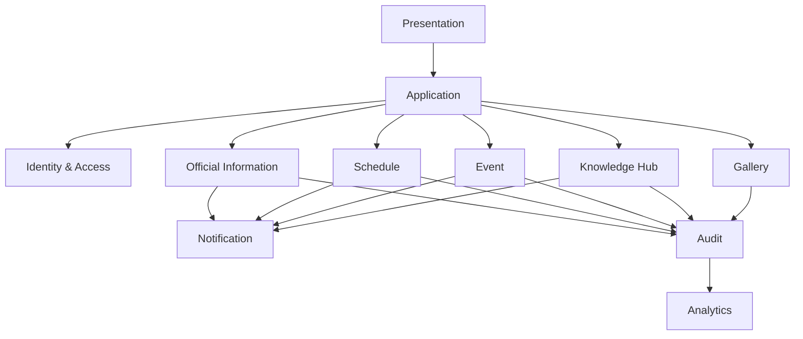

# AHS-002: Module Boundaries

> **Architecture Hardening Specification (AHS)**
>
> **Platform Digital Informatika Angkatan 2025**
>
> **Status:** ✅ Approved
>
> **Priority:** 🔴 Critical

---

# 📖 Overview

Dokumen ini mendefinisikan batas tanggung jawab modul serta strategi komunikasi antar modul pada Platform Digital Informatika Angkatan 2025.

Tujuan utama dokumen ini adalah memastikan setiap modul memiliki tanggung jawab yang jelas dan interaksi antar modul dilakukan melalui mekanisme yang terkontrol.

Batas modul yang didefinisikan pada dokumen ini menjadi bagian dari architecture baseline untuk MVP.

---

# 🎯 Objectives

Dokumen ini bertujuan untuk:

* Mendefinisikan batas tanggung jawab setiap modul.
* Menentukan aturan komunikasi antar modul.
* Mengurangi coupling antar modul.
* Mencegah akses langsung terhadap implementasi internal modul lain.
* Menjaga modularitas sistem selama implementasi.
* Menjadi acuan dalam pengembangan fitur yang melibatkan lebih dari satu modul.

---

# 📦 Scope

Dokumen ini mencakup:

* Module Boundaries
* Module Ownership
* Module Communication
* Dependency Direction
* Cross-Module Access Rules
* Communication Constraints

Dokumen ini tidak mendefinisikan endpoint API secara rinci maupun struktur request/response.

---

# 🧱 Module Boundaries

Setiap modul memiliki tanggung jawab bisnis dan teknis yang terbatas pada domain yang dimilikinya.

Modul utama sistem meliputi:

| Module               | Primary Responsibility                                    |
| -------------------- | --------------------------------------------------------- |
| Identity & Access    | Authentication, session, user identity, dan authorization |
| Dashboard            | Agregasi informasi untuk tampilan utama pengguna          |
| Official Information | Pengelolaan pengumuman resmi                              |
| Schedule             | Pengelolaan jadwal kuliah                                 |
| Event                | Pengelolaan kegiatan angkatan                             |
| Knowledge Hub        | Pengelolaan resource pembelajaran                         |
| Gallery              | Pengelolaan album dan media                               |
| Notification         | Pengelolaan notifikasi sistem                             |
| Audit                | Pencatatan aktivitas penting                              |
| Analytics            | Pengumpulan dan penyajian data analitik                   |
| Governance           | Pengelolaan konfigurasi dan kebijakan sistem              |

---

# 👤 Module Ownership

Setiap modul bertanggung jawab terhadap domain yang dimilikinya.

Contoh:

```text
Identity & Access
        │
        └── User Identity & Access Control

Official Information
        │
        └── Announcement

Schedule
        │
        └── Class Schedule

Knowledge Hub
        │
        └── Learning Resource

Event
        │
        └── Event & Registration

Gallery
        │
        └── Album & Media
```

Modul lain tidak boleh mengambil alih kepemilikan data tersebut.

---

# 🔄 Module Communication Strategy

Komunikasi antar modul harus dilakukan melalui **contract/interface** yang telah ditentukan.

Prinsip komunikasi:

```text
Module A
   │
   │ Contract / Interface
   ▼
Module B
```

Modul A tidak diperbolehkan mengakses implementasi internal Modul B secara langsung.

Contoh yang tidak diperbolehkan:

```text
Schedule
   │
   └── Direct access
          ▼
Knowledge Hub Repository
```

Contoh yang diperbolehkan:

```text
Schedule
   │
   └── Defined Interface
          ▼
Knowledge Hub Service
```

---

# 🧭 Dependency Direction

Dependency antar modul harus memiliki arah yang jelas.



Diagram tersebut menunjukkan arah dependency konseptual, bukan implementasi package atau source-code structure.

---

# 🔐 Cross-Module Access Rules

Modul harus mengikuti aturan berikut:

### Rule 1 — No Direct Internal Access

Modul tidak boleh mengakses repository, model, atau implementasi internal modul lain secara langsung.

### Rule 2 — Contract-Based Communication

Interaksi antar modul harus menggunakan contract atau interface yang telah didefinisikan.

### Rule 3 — Single Ownership

Satu data hanya memiliki satu module owner.

### Rule 4 — Minimal Dependency

Modul hanya boleh memiliki dependency yang benar-benar dibutuhkan.

### Rule 5 — No Circular Dependency

Circular dependency antar modul harus dihindari.

Contoh yang tidak diperbolehkan:

```text
Module A
   │
   ▼
Module B
   │
   ▼
Module A
```

---

# 📊 Module Dependency Classification

Dependency antar modul dapat dikategorikan menjadi:

| Dependency Type    | Description                                                    |
| ------------------ | -------------------------------------------------------------- |
| Required           | Modul tidak dapat menjalankan fungsi tertentu tanpa dependency |
| Optional           | Modul dapat tetap berjalan tanpa dependency                    |
| Event/Notification | Modul menerima informasi akibat perubahan pada modul lain      |
| Aggregation        | Modul menggabungkan data dari beberapa modul                   |

Contoh:

**Dashboard** merupakan modul agregasi karena membutuhkan informasi dari beberapa domain:

```text
             ┌── Announcement
             │
Dashboard ───┼── Schedule
             │
             ├── Event
             │
             └── Knowledge Hub
```

---

# 🧩 Dashboard as Aggregator

Dashboard tidak menjadi pemilik data dari domain lain.

Dashboard hanya mengambil dan menggabungkan data untuk kebutuhan presentation.

```text
Announcement ──┐
Schedule ──────┤
Event ─────────┼──► Dashboard
Knowledge Hub ─┘
```

Dengan demikian:

* Announcement tetap menjadi owner Announcement.
* Schedule tetap menjadi owner Schedule.
* Event tetap menjadi owner Event.
* Knowledge Hub tetap menjadi owner Resource.

Dashboard hanya bertindak sebagai consumer.

---

# 🔔 Notification Communication

Notification merupakan modul yang digunakan oleh beberapa domain untuk menghasilkan informasi kepada pengguna.

Contoh:

```text
Announcement ──┐
Schedule ──────┤
Event ─────────┼──► Notification
Knowledge Hub ─┘
```

Domain sumber bertanggung jawab menentukan kapan sebuah aktivitas menghasilkan notifikasi.

Notification bertanggung jawab terhadap proses pengelolaan notifikasi tersebut.

---

# 📝 Audit Communication

Aktivitas penting dari domain dapat diteruskan kepada Audit.

```text
Official Information ──┐
Schedule ──────────────┤
Event ─────────────────┼──► Audit
Knowledge Hub ────────┤
Gallery ───────────────┘
```

Audit tidak mengambil alih business logic dari domain sumber.

Audit hanya bertanggung jawab mencatat aktivitas yang relevan.

---

# 🚧 Architecture Constraints

Implementasi harus mematuhi batasan berikut:

* Tidak diperbolehkan melakukan direct database access antar modul.
* Tidak diperbolehkan mengakses repository internal modul lain secara langsung.
* Tidak diperbolehkan membuat circular dependency.
* Modul tidak boleh mengambil alih ownership domain lain.
* Dependency harus memiliki alasan yang jelas.
* Perubahan module boundary harus melalui architecture review.

---

# 🔄 Change Management

Perubahan terhadap module boundary harus dievaluasi apabila perubahan tersebut:

* Menambah dependency baru.
* Mengubah ownership data.
* Mengubah komunikasi antar domain.
* Membuat dependency baru menjadi critical.
* Berpotensi menghasilkan circular dependency.
* Mengubah responsibility utama sebuah modul.

Perubahan yang signifikan harus diperbarui pada dokumentasi arsitektur terkait.

---

# 📚 Related Documents

## Previous Documents

* [AHS README](./README.md)
* [AHS-001: Architecture Overview](./01-ahs-001-architecture-overview.md)

## Related Documents

* [DDS-002: Component Design](../DDS/02-dds-002-component-design.md)
* [DDS-003: Domain Design](../DDS/03-dds-003-domain-design.md)
* [DDS-005: Interface Design](../DDS/05-dds-005-interface-design.md)

## Next Document

* [AHS-003: Authentication & Authorization](./03-ahs-003-authentication-and-authorization.md)

---

# ✅ Review Checklist

* [ ] Module ownership telah ditentukan.
* [ ] Batas tanggung jawab modul telah didefinisikan.
* [ ] Strategi komunikasi antar modul telah ditentukan.
* [ ] Dependency direction telah dijelaskan.
* [ ] Cross-module access rules telah ditetapkan.
* [ ] Circular dependency telah dilarang.
* [ ] Perubahan module boundary memiliki mekanisme review.

---

# 🔄 Traceability Matrix

| Area                 | Related Documentation |
| -------------------- | --------------------- |
| Module Architecture  | SDS                   |
| Component Design     | DDS-002               |
| Domain Design        | DDS-003               |
| Interface Design     | DDS-005               |
| Module Communication | AHS-002               |
| Notification         | RHS                   |
| Audit                | RHS                   |
| Architecture Rules   | AHS-010               |

---

# 📝 Revision History

| Version | Date       | Description                             | Author          |
| ------- | ---------- | --------------------------------------- | --------------- |
| 1.0     | 2026-08-08 | Initial Module Boundaries documentation | Abidzar Dzakwan |

```

**Catatan penting:** AHS-002 ini sengaja tidak mengulang seluruh desain komponen dari DDS-002. DDS menjelaskan desainnya, sedangkan AHS-002 **meng-hardening aturan yang tidak boleh dilanggar ketika implementasi dimulai**. Dengan begitu, hubungan DDS → AHS tetap jelas dan tidak menjadi duplikasi.
```
