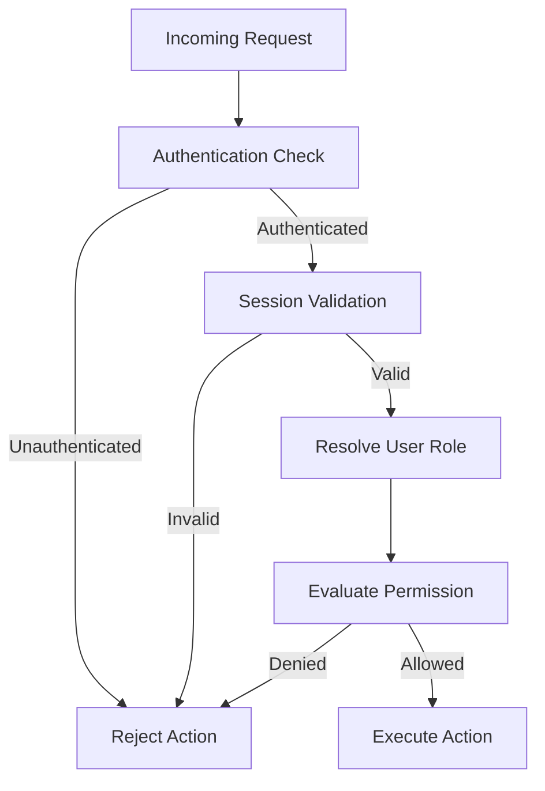

# AHS-003: Authentication & Authorization

> **Architecture Hardening Specification (AHS)**
>
> **Platform Digital Informatika Angkatan 2025**
>
> **Status:** ✅ Approved
>
> **Priority:** 🔴 Critical

---

# 📖 Overview

Dokumen ini mendefinisikan strategi *authentication*, *session management*, dan *authorization* untuk Platform Digital Informatika Angkatan 2025.

Tujuan utama dokumen ini adalah memastikan bahwa identitas pengguna, sesi akses, dan hak akses dievaluasi melalui alur yang konsisten sebelum pengguna dapat melakukan tindakan yang dilindungi sistem.

Dokumen ini berfokus pada keputusan arsitektur dan aturan yang harus dipatuhi selama implementasi. Detail implementasi seperti struktur source code, library, konfigurasi runtime, dan kode autentikasi berada pada dokumentasi implementasi terkait.

---

# 🎯 Objectives

Dokumen ini bertujuan untuk:

* Memastikan hanya pengguna yang terautentikasi yang dapat mengakses resource yang dilindungi.
* Menentukan alur validasi session.
* Memisahkan authentication dan authorization.
* Memastikan permission dievaluasi sebelum protected action dijalankan.
* Menjaga konsistensi akses berdasarkan role dan permission.
* Mencegah bypass terhadap mekanisme authorization.

---

# 📦 Scope

Dokumen ini mencakup:

* Authentication Strategy
* Session Strategy
* Authorization Strategy
* Role-Based Access Control
* Permission Evaluation
* Protected Resource Access
* Authentication & Authorization Failure

Dokumen ini tidak mendefinisikan endpoint API secara rinci.

---

# 🔐 Authentication Strategy

Authentication bertanggung jawab untuk memastikan identitas pengguna.

Alur konseptual:

```text
User
 │
 ▼
Login
 │
 ▼
Credential Validation
 │
 ├── Invalid ──► Authentication Failure
 │
 ▼
Session Creation
 │
 ▼
Authenticated User
```

Authentication harus berhasil sebelum pengguna dapat melakukan operasi yang membutuhkan identitas terverifikasi.

---

# 👤 Session Strategy

Session merepresentasikan status autentikasi pengguna setelah proses login berhasil.

Lifecycle session:

```text
Unauthenticated
      │
      ▼
Authentication
      │
      ▼
Authenticated Session
      │
      ├──── Request ────► Session Validation
      │
      ▼
Logout / Expiration
      │
      ▼
Unauthenticated
```

Session harus:

* Dibuat setelah authentication berhasil.
* Divalidasi ketika mengakses resource yang dilindungi.
* Dapat diakhiri melalui logout.
* Berakhir sesuai kebijakan expiration yang telah ditetapkan.
* Tidak dapat digunakan setelah session dinyatakan tidak valid.

---

# 🔒 Protected Resource

Tidak semua resource membutuhkan authentication.

Resource dibagi menjadi dua kategori:

| Resource Type      | Authentication |
| ------------------ | -------------- |
| Public Resource    | Tidak wajib    |
| Protected Resource | Wajib          |

Contoh protected action:

* Mengubah profile.
* Mengelola announcement.
* Mengubah schedule.
* Mengelola resource.
* Mengelola event.
* Mengubah konfigurasi sistem.

---

# 🛡️ Authorization Strategy

Authentication menjawab:

> **"Siapa pengguna ini?"**

Authorization menjawab:

> **"Apakah pengguna ini diperbolehkan melakukan tindakan tersebut?"**

Kedua proses harus dipisahkan.

```text
Authentication
      │
      ▼
Authenticated User
      │
      ▼
Authorization
      │
      ├── Allowed ──► Execute Action
      │
      └── Denied ───► Reject Action
```

---

# 👥 Role-Based Access Control

Platform menggunakan pendekatan **Role-Based Access Control (RBAC)**.

Role menentukan kumpulan permission yang dimiliki pengguna.

Konsep dasarnya:

```text
User
 │
 ▼
Role
 │
 ▼
Permissions
 │
 ▼
Allowed Actions
```

Role utama sistem meliputi:

| Role                   | General Responsibility                       |
| ---------------------- | -------------------------------------------- |
| Superadmin             | Pengelolaan utama sistem                     |
| Administrator Cadangan | Dukungan administrasi dengan hak terbatas    |
| Student                | Mengakses fitur yang tersedia bagi mahasiswa |

Detail permission setiap role harus mengikuti requirement yang telah ditetapkan pada RHS.

---

# 🔍 Authorization Evaluation Flow

Setiap protected action harus melalui evaluasi authorization.



Tidak diperbolehkan menjalankan protected action sebelum proses authorization selesai.

---

# 🔐 Permission Evaluation

Permission harus dievaluasi berdasarkan:

* Identity pengguna.
* Role pengguna.
* Permission yang dimiliki.
* Resource yang diakses.
* Action yang dilakukan.

Contoh:

```text
User
 │
 ├── Role: Superadmin
 │
 └── Permission:
       ├── announcement.create
       ├── announcement.update
       ├── announcement.publish
       └── schedule.update
```

Permission tidak boleh ditentukan hanya berdasarkan kondisi frontend.

---

# 🖥️ Frontend Authorization

Frontend dapat digunakan untuk:

* Menyembunyikan action yang tidak tersedia.
* Menampilkan UI sesuai role.
* Meningkatkan pengalaman pengguna.

Namun frontend **bukan security boundary**.

Contoh:

```text
Frontend
   │
   └── Hide "Publish" Button
```

tidak berarti pengguna otomatis tidak dapat melakukan:

```text
Unauthorized Publish Request
```

Karena itu authorization wajib tetap dilakukan pada backend atau security boundary yang dipercaya.

---

# 🚫 Authorization Bypass Prevention

Implementasi tidak boleh mengandalkan:

* Visibility button.
* Route protection frontend saja.
* Role yang dikirim oleh client.
* Permission yang dikirim oleh client.
* Data authorization yang tidak diverifikasi server.

Server harus menentukan authorization berdasarkan identity dan permission yang telah diverifikasi.

---

# ⚠️ Authentication Failure

Authentication failure terjadi ketika identitas pengguna tidak dapat diverifikasi.

Contoh:

* Credential tidak valid.
* Session tidak valid.
* Session telah expired.
* Credential tidak memenuhi validasi.

Authentication failure harus menghentikan akses ke protected resource.

---

# ⚠️ Authorization Failure

Authorization failure terjadi ketika pengguna telah terautentikasi tetapi tidak memiliki permission untuk melakukan tindakan tertentu.

```text
Authenticated
      │
      ▼
Permission Check
      │
      ▼
Denied
      │
      ▼
Action Rejected
```

Authorization failure tidak boleh diperlakukan sebagai authentication failure karena kedua kondisi memiliki makna yang berbeda.

---

# 🔄 First Login Consideration

Sesuai mekanisme onboarding yang telah ditetapkan, akun yang dibuat oleh administrator menggunakan credential sementara harus menjalani proses perubahan password pada login pertama.

Alur:

```text
Account Created
      │
      ▼
Temporary Credential
      │
      ▼
First Login
      │
      ▼
Force Password Change
      │
      ▼
Normal Authentication Flow
```

Pengguna tidak boleh menyelesaikan onboarding authentication tanpa memenuhi proses perubahan credential pertama yang diwajibkan.

---

# 🧩 Security Boundary

Authentication dan authorization menjadi bagian dari security boundary sistem.

```text
                 Security Boundary
                        │
                        ▼
                ┌───────────────┐
                │ Authentication│
                └───────┬───────┘
                        │
                        ▼
                ┌───────────────┐
                │ Authorization │
                └───────┬───────┘
                        │
                        ▼
                ┌───────────────┐
                │ Business Logic│
                └───────────────┘
```

Business operation yang bersifat protected tidak boleh melewati boundary tersebut.

---

# 🚧 Architecture Constraints

Implementasi harus mematuhi aturan berikut:

* Authentication harus diverifikasi sebelum protected access.
* Session harus divalidasi.
* Authorization harus dilakukan sebelum protected action.
* Permission tidak boleh dipercaya hanya dari client.
* Frontend tidak boleh menjadi satu-satunya security boundary.
* Role dan permission harus diverifikasi pada trusted backend boundary.
* Authentication dan authorization failure harus dibedakan.
* Perubahan model authorization harus melalui architecture review.

---

# 🔄 Change Management

Perubahan terhadap authentication atau authorization harus melalui review apabila perubahan tersebut:

* Mengubah session lifecycle.
* Mengubah role model.
* Menambah atau menghapus permission.
* Mengubah security boundary.
* Mengubah cara protected resource diakses.
* Mengubah mekanisme credential management.

Perubahan signifikan harus ditelusuri kembali ke RHS, IDR, SDS, dan DDS.

---

# 📚 Related Documents

## Previous Documents

* [AHS README](./README.md)
* [AHS-001: Architecture Overview](./01-ahs-001-architecture-overview.md)
* [AHS-002: Module Boundaries](./02-ahs-002-module-boundaries.md)

## Related Design Documents

* [RHS-001: Authentication](../rhs/01-rhs-001-authentication.md)
* [DDS-006: Security Design](../DDS/06-dds-006-security-design.md)
* [IDR-002: Technology Stack](../IDR/02-idr-002-technology-stack.md)

## Next Document

* [AHS-004: File Storage & Data Consistency](./04-ahs-004-file-storage-and-data-consistency.md)

---

# ✅ Review Checklist

* [ ] Authentication strategy telah ditentukan.
* [ ] Session lifecycle telah didefinisikan.
* [ ] Authorization flow telah ditentukan.
* [ ] RBAC telah ditetapkan.
* [ ] Permission evaluation telah dijelaskan.
* [ ] Frontend telah diposisikan sebagai bukan security boundary.
* [ ] Authentication dan authorization failure telah dibedakan.
* [ ] First-login password change telah diperhitungkan.
* [ ] Security boundary telah ditetapkan.

---

# 🔄 Traceability Matrix

| Area                      | Related Documentation |
| ------------------------- | --------------------- |
| Authentication            | RHS-001               |
| Session Management        | RHS-001               |
| Authorization             | RHS-001               |
| Role & Permission         | RHS-001               |
| Security Architecture     | SDS                   |
| Security Design           | DDS-006               |
| Technology Implementation | IDR-002               |
| Authentication Hardening  | AHS-003               |

---

# 📝 Revision History

| Version | Date       | Description                                          | Author          |
| ------- | ---------- | ---------------------------------------------------- | --------------- |
| 1.0     | 2026-08-08 | Initial Authentication & Authorization documentation | Abidzar Dzakwan |
