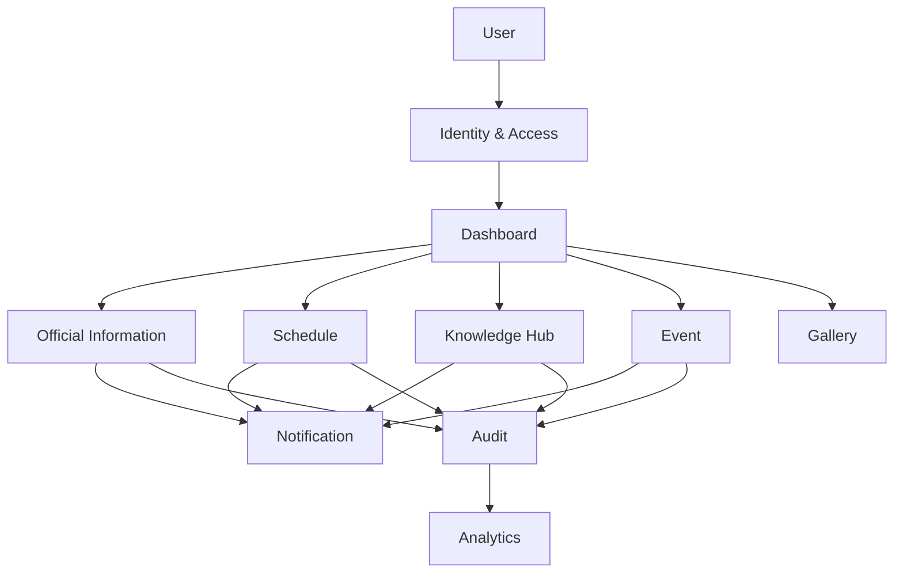

# DDS-001: System Design Overview

> **Detailed Design Specification (DDS)**
>
> **Reference:** PRD, RHS, IDR, SDS
>
> **Status:** ✅ Approved
>
> **Priority:** 🔴 Critical

---

# 📖 Overview

Dokumen ini mendefinisikan gambaran umum desain teknis (*System Design Overview*) untuk Platform Digital Informatika Angkatan 2025.

System Design Overview merupakan transisi dari desain arsitektur tingkat tinggi (Software Design Specification) menuju desain teknis yang menjadi acuan implementasi sistem.

Dokumen ini memberikan pandangan menyeluruh mengenai struktur sistem, pembagian komponen, hubungan antar domain, serta pendekatan implementasi yang akan digunakan oleh Engineering Team.

Dokumen ini tidak membahas implementasi source code maupun konfigurasi deployment secara rinci.

---

# 🎯 Objectives

System Design Overview bertujuan untuk:

- Menjelaskan desain teknis sistem secara umum.
- Menjadi penghubung antara Software Design Specification dan implementasi.
- Memberikan konteks sebelum membahas desain komponen secara rinci.
- Menjadi acuan bagi seluruh Engineering Team.
- Menjaga konsistensi implementasi terhadap dokumen sebelumnya.

---

# 📦 Scope

Dokumen ini mencakup:

- System Design Overview
- Design Objectives
- System Components Overview
- Design Boundaries
- Design Principles
- System Relationships

---

# 🏛️ Design Overview

Platform Digital Informatika Angkatan 2025 dibangun menggunakan pendekatan **Modular Monolith** dengan pembagian domain berdasarkan tanggung jawab bisnis.

Setiap domain memiliki batas tanggung jawab yang jelas dan saling berinteraksi melalui mekanisme yang telah ditetapkan pada desain arsitektur.

Desain teknis pada DDS berfokus pada bagaimana komponen-komponen tersebut diimplementasikan tanpa mengubah prinsip arsitektur yang telah ditetapkan pada SDS.

---

# 🧩 System Components Overview

Sistem terdiri atas komponen utama berikut.

| Component | Responsibility |
|------------|----------------|
| Identity & Access | Authentication, Authorization, Account Management |
| Dashboard | Information Aggregation |
| Official Information | Publication Management |
| Schedule | Academic Schedule Management |
| Knowledge Hub | Learning Resource Management |
| Event | Event Management |
| Gallery | Media Management |
| Notification | Notification Delivery |
| Audit | Activity Logging |
| Analytics | Usage Analytics |
| Governance | System Administration |

---

# 🔄 High-Level Component Relationship



---

# 🏗️ Design Principles

Seluruh desain teknis mengikuti prinsip berikut.

- Separation of Concerns
- Single Responsibility
- High Cohesion
- Low Coupling
- Reusability
- Maintainability
- Extensibility
- Security by Design

Prinsip-prinsip tersebut merupakan turunan langsung dari Architecture Principles yang telah ditetapkan pada Software Design Specification.

---

# 🚧 Design Boundaries

Dokumen ini tidak mencakup:

- Implementasi source code.
- Kontrak API secara rinci.
- Konfigurasi deployment.
- Infrastruktur operasional.
- CI/CD Pipeline.
- Monitoring dan observability.

Topik tersebut dijelaskan pada dokumentasi lain yang relevan.

---

# 🔗 Relationship with Other Documents

```text
PRD
 │
 ▼
RHS
 │
 ▼
IDR
 │
 ▼
SDS
 │
 ▼
DDS-001
 │
 ├── DDS-002 Component Design
 ├── DDS-003 Domain Design
 ├── DDS-004 Data Design
 ├── DDS-005 Interface Design
 ├── DDS-006 Security Design
 ├── DDS-007 Design Decisions
 └── DDS-008 Design Summary
```

---

# 📚 Related Documents

## Previous Documents

- PRD
- RHS
- IDR
- SDS-001 hingga SDS-009

## Next Documents

- DDS-002: Component Design

---

# ✅ Review Checklist

- [ ] Gambaran umum desain teknis telah dijelaskan.
- [ ] Komponen utama sistem telah diidentifikasi.
- [ ] Hubungan antar komponen telah dijelaskan.
- [ ] Batas ruang lingkup DDS telah ditentukan.
- [ ] Selaras dengan Software Design Specification.

---

# 🔄 Traceability Matrix

| Design Area | Related Document |
|--------------|------------------|
| System Overview | SDS-001 |
| Architecture Principles | SDS-002 |
| Technology Stack | SDS-003 |
| High-Level Architecture | SDS-004 |
| Domain Design | SDS-005 |
| Architecture Constraints | SDS-006 |
| Architecture Decisions | SDS-008 |

---

# 🔗 References

## Product Documentation

- [Product Requirements Document (PRD)](../PRD.md)
- [Requirements Hardening Specification (RHS)](../rhs/README.md)
- [Implementation Detail Records (IDR)](../IDR/README.md)
- [Software Design Specification (SDS)](../SDS/README.md)

## Related DDS

- [DDS README](./README.md)
- [DDS-002: Component Design](./02-dds-002-component-design.md)

---

# 📝 Revision History

| Version | Date | Description |
|----------|------|-------------|
| 1.0 | 2026-08-06 | Initial System Design Overview documentation |
