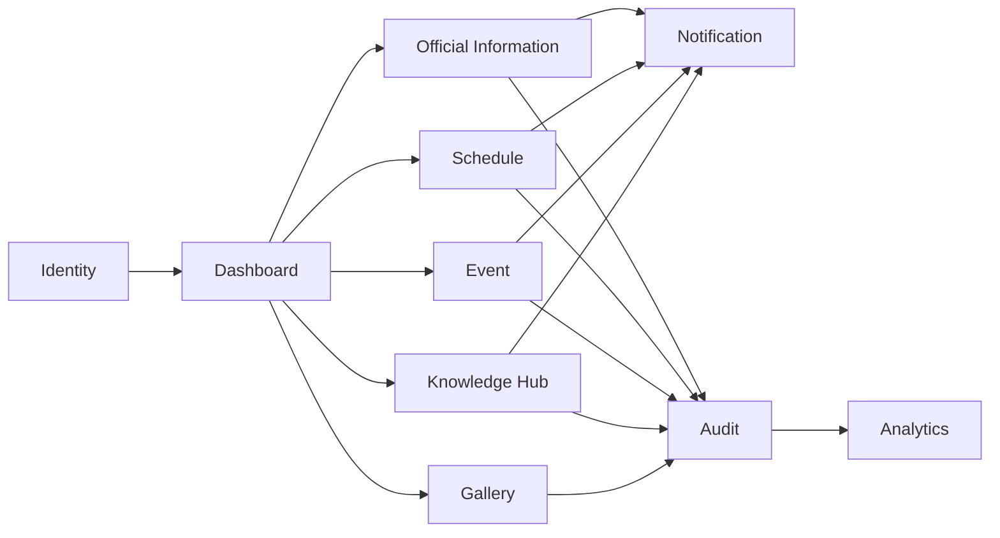

# DDS-002: Component Design

> **Detailed Design Specification (DDS)**
>
> **Reference:** PRD, RHS, IDR, SDS
>
> **Status:** ✅ Approved
>
> **Priority:** 🔴 Critical

---

# 📖 Overview

Dokumen ini mendefinisikan desain komponen (*Component Design*) untuk Platform Digital Informatika Angkatan 2025.

Component Design menjelaskan bagaimana sistem dipecah menjadi komponen-komponen utama, tanggung jawab setiap komponen, hubungan antar komponen, serta prinsip komunikasi yang digunakan.

Dokumen ini menjadi dasar implementasi modul aplikasi tanpa membahas detail source code.

---

# 🎯 Objectives

Component Design bertujuan untuk:

- Mendefinisikan struktur komponen sistem.
- Menjelaskan tanggung jawab setiap komponen.
- Mendokumentasikan hubungan antar komponen.
- Mengurangi coupling antar modul.
- Menjadi acuan implementasi Engineering Team.

---

# 📦 Scope

Dokumen ini mencakup:

- Component Overview
- Component Responsibilities
- Component Dependencies
- Component Communication
- Design Principles
- Design Constraints

---

# 🏛️ Component Architecture

Platform dibangun menggunakan pendekatan **Modular Monolith**, di mana setiap domain bisnis direpresentasikan sebagai komponen yang memiliki tanggung jawab spesifik.

Setiap komponen:

- Memiliki satu tanggung jawab utama (*Single Responsibility*).
- Tidak mengakses data milik komponen lain secara langsung.
- Berinteraksi melalui service atau antarmuka yang telah ditentukan.
- Dapat dikembangkan secara independen tanpa mengubah kontrak komponen lain.

---

# 🧩 Core Components

| Component | Responsibility |
|------------|----------------|
| Identity & Access | Authentication, Authorization, User Management |
| Dashboard | Menyajikan ringkasan informasi pengguna |
| Official Information | Pengelolaan pengumuman resmi |
| Schedule | Pengelolaan jadwal akademik |
| Knowledge Hub | Pengelolaan sumber belajar |
| Event | Pengelolaan kegiatan dan agenda |
| Gallery | Pengelolaan media dan dokumentasi |
| Notification | Pengiriman notifikasi |
| Audit | Pencatatan aktivitas sistem |
| Analytics | Analisis penggunaan sistem |
| Governance | Administrasi dan konfigurasi aplikasi |

---

# 🔄 Component Interaction

---

# 📌 Component Responsibilities

## Identity & Access

Bertanggung jawab terhadap:

- Login
- Logout
- Authentication
- Authorization
- Session Management
- Profile Management

---

## Dashboard

Bertanggung jawab terhadap:

- Ringkasan informasi
- Widget utama
- Quick Access
- Statistik pengguna

---

## Official Information

Bertanggung jawab terhadap:

- Publikasi pengumuman
- Kategori informasi
- Status publikasi
- Riwayat perubahan

---

## Schedule

Bertanggung jawab terhadap:

- Jadwal kuliah
- Jadwal kegiatan
- Perubahan jadwal
- Sinkronisasi kalender

---

## Knowledge Hub

Bertanggung jawab terhadap:

- Resource Management
- Kategori materi
- Persetujuan resource
- Publikasi resource

---

## Event

Bertanggung jawab terhadap:

- Manajemen event
- Registrasi peserta
- Jadwal kegiatan
- Dokumentasi acara

---

## Gallery

Bertanggung jawab terhadap:

- Album
- Media
- Kategori
- Publikasi dokumentasi

---

## Notification

Bertanggung jawab terhadap:

- In-App Notification
- Distribusi notifikasi
- Status notifikasi

---

## Audit

Bertanggung jawab terhadap:

- Audit Log
- Activity Tracking
- Change History

---

## Analytics

Bertanggung jawab terhadap:

- Statistik penggunaan
- Ringkasan aktivitas
- Monitoring operasional

---

## Governance

Bertanggung jawab terhadap:

- Pengelolaan konfigurasi sistem
- Administrasi platform
- Pengelolaan kebijakan operasional

---

# 🔐 Component Design Principles

Seluruh komponen harus mengikuti prinsip berikut:

- Single Responsibility Principle
- High Cohesion
- Low Coupling
- Interface-Based Communication
- Encapsulation
- Reusability
- Maintainability

---

# 🚧 Design Constraints

- Komponen tidak boleh mengakses data internal komponen lain secara langsung.
- Setiap komponen harus memiliki batas tanggung jawab yang jelas.
- Ketergantungan antar komponen harus diminimalkan.
- Perubahan pada satu komponen tidak boleh memengaruhi komponen lain tanpa alasan yang jelas.

---

# 📚 Related Documents

## Previous Documents

- DDS-001: System Design Overview

## Next Documents

- DDS-003: Domain Design

---

# ✅ Review Checklist

- [ ] Seluruh komponen telah diidentifikasi.
- [ ] Tanggung jawab komponen telah dijelaskan.
- [ ] Hubungan antar komponen telah terdokumentasi.
- [ ] Prinsip desain telah ditetapkan.
- [ ] Selaras dengan Software Design Specification.

---

# 🔄 Traceability Matrix

| Component | Related Document |
|------------|------------------|
| Identity & Access | RHS-001 |
| Dashboard | RHS-003 |
| Official Information | RHS-002 |
| Schedule | RHS-004 |
| Knowledge Hub | RHS-005 |
| Event | RHS-006 |
| Gallery | RHS-007 |
| Notification | RHS-011 |
| Audit | RHS-012 |
| Analytics | RHS-015 |
| Governance | RHS-018 |

---

# 🔗 References

## Product Documentation

- [Product Requirements Document (PRD)](../PRD.md)
- [Requirements Hardening Specification (RHS)](../rhs/README.md)
- [Implementation Detail Records (IDR)](../IDR/README.md)
- [Software Design Specification (SDS)](../SDS/README.md)

## Related DDS

- [DDS README](./README.md)
- [DDS-001: System Design Overview](./01-dds-001-system-design-overview.md)
- [DDS-003: Domain Design](./03-dds-003-domain-design.md)

---

# 📝 Revision History

| Version | Date | Description |
|----------|------|-------------|
| 1.0 | 2026-08-06 | Initial Component Design documentation |
