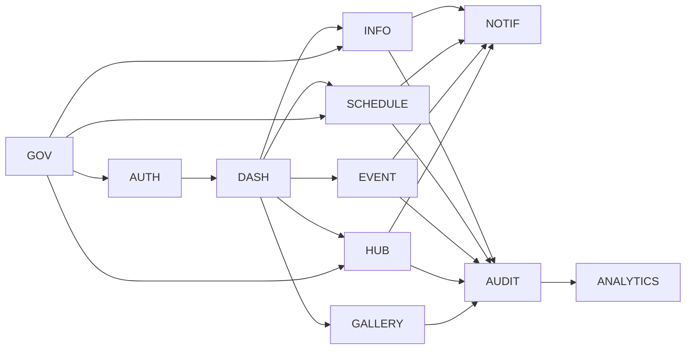

# DDS-003: Domain Design

> **Detailed Design Specification (DDS)**
>
> **Reference:** PRD, RHS, IDR, SDS
>
> **Status:** ✅ Approved
>
> **Priority:** 🔴 Critical

---

# 📖 Overview

Dokumen ini mendefinisikan desain domain (*Domain Design*) untuk Platform Digital Informatika Angkatan 2025.

Domain Design menjelaskan pembagian domain bisnis ke dalam batas tanggung jawab (*Bounded Context*), layanan utama, kepemilikan data, serta hubungan antar domain. Tujuannya adalah memastikan setiap domain memiliki tanggung jawab yang jelas, mengurangi ketergantungan antar modul, dan menjaga konsistensi implementasi.

Dokumen ini tidak membahas implementasi basis data secara rinci maupun kontrak API.

---

# 🎯 Objectives

Domain Design bertujuan untuk:

- Mendefinisikan domain bisnis secara rinci.
- Menentukan batas tanggung jawab setiap domain.
- Menjelaskan hubungan antar domain.
- Mendokumentasikan kepemilikan data (*Data Ownership*).
- Menjadi acuan implementasi layanan pada setiap domain.

---

# 📦 Scope

Dokumen ini mencakup:

- Domain Identification
- Bounded Context
- Domain Responsibilities
- Domain Relationships
- Data Ownership
- Domain Principles

---

# 🏗️ Domain Architecture

Platform dibangun berdasarkan pendekatan **Domain-Oriented Modular Monolith**.

Setiap domain memiliki:

- Tanggung jawab yang spesifik.
- Service internal.
- Repository internal.
- Model bisnis sendiri.
- Data yang dikelola secara mandiri.

Interaksi antar domain dilakukan melalui antarmuka layanan yang telah ditentukan dan tidak melalui akses langsung ke data domain lain.

---

# 🧩 Business Domains

| Domain | Primary Responsibility |
|----------|------------------------|
| Identity & Access | Authentication, Authorization, User Management |
| Dashboard | Information Aggregation |
| Official Information | Official Announcement Management |
| Schedule | Academic Schedule Management |
| Knowledge Hub | Learning Resource Management |
| Event | Event Management |
| Gallery | Media & Documentation Management |
| Notification | Notification Delivery |
| Audit | Activity Logging |
| Analytics | Usage Analytics |
| Governance | System Administration & Configuration |

---

# 📋 Domain Responsibilities

## Identity & Access

### Responsibilities

- Authentication
- Authorization
- User Profile
- Session Management
- Password Management

### Owns

- User Identity
- Role
- Permission
- Session

---

## Dashboard

### Responsibilities

- Dashboard Composition
- Widget Management
- Personalized Overview

### Owns

- Dashboard Configuration
- User Dashboard Preferences

---

## Official Information

### Responsibilities

- Announcement Publication
- Information Categorization
- Publication Workflow

### Owns

- Announcement
- Category
- Publication Status

---

## Schedule

### Responsibilities

- Academic Schedule
- Event Schedule
- Schedule Revision

### Owns

- Schedule
- Time Slot
- Schedule Version

---

## Knowledge Hub

### Responsibilities

- Resource Management
- Learning Material Publication
- Resource Approval

### Owns

- Resource
- Resource Category
- Resource Version

---

## Event

### Responsibilities

- Event Planning
- Registration
- Attendance

### Owns

- Event
- Registration
- Attendance Record

---

## Gallery

### Responsibilities

- Album Management
- Media Publication

### Owns

- Album
- Media
- Gallery Category

---

## Notification

### Responsibilities

- Notification Distribution
- Notification Queue
- Delivery Status

### Owns

- Notification
- Delivery Record

---

## Audit

### Responsibilities

- Audit Logging
- Activity Tracking

### Owns

- Audit Log
- Change History

---

## Analytics

### Responsibilities

- Usage Metrics
- Operational Statistics

### Owns

- Analytics Record
- Aggregated Metrics

---

## Governance

### Responsibilities

- Platform Configuration
- Administrative Policies

### Owns

- System Configuration
- Platform Settings

---

# 🔄 Domain Relationships

---

# 🔒 Data Ownership Principles

Setiap domain bertanggung jawab penuh terhadap data yang dimilikinya.

Prinsip yang digunakan:

- Single Source of Truth
- Encapsulation
- High Cohesion
- Low Coupling
- Controlled Data Access

Tidak diperbolehkan mengakses data internal domain lain secara langsung tanpa melalui service yang telah ditentukan.

---

# 🏛️ Domain Design Principles

Seluruh domain mengikuti prinsip:

- Single Responsibility
- Separation of Concerns
- Domain Isolation
- Service-Oriented Interaction
- Explicit Dependencies
- Reusability
- Maintainability

---

# 🚧 Design Constraints

- Satu domain tidak boleh menjadi pemilik data domain lain.
- Domain tidak boleh memiliki business logic yang saling tumpang tindih.
- Ketergantungan antar domain harus seminimal mungkin.
- Perubahan pada satu domain tidak boleh memengaruhi kontrak domain lain secara langsung.

---

# 📚 Related Documents

## Previous Documents

- DDS-001: System Design Overview
- DDS-002: Component Design

## Next Documents

- DDS-004: Data Design

---

# ✅ Review Checklist

- [ ] Seluruh domain telah diidentifikasi.
- [ ] Tanggung jawab domain telah ditetapkan.
- [ ] Kepemilikan data telah didefinisikan.
- [ ] Hubungan antar domain telah dijelaskan.
- [ ] Selaras dengan Software Design Specification.

---

# 🔄 Traceability Matrix

| Domain | Related RHS |
|----------|-------------|
| Identity & Access | RHS-001 |
| Dashboard | RHS-003 |
| Official Information | RHS-002 |
| Schedule | RHS-004 |
| Knowledge Hub | RHS-005 |
| Event | RHS-006 |
| Gallery | RHS-007 |
| Notification | RHS-011 |
| Audit | RHS-012 |
| Analytics | RHS-015 |
| Governance | RHS-018 |

---

# 🔗 References

## Product Documentation

- [Product Requirements Document (PRD)](../PRD.md)
- [Requirements Hardening Specification (RHS)](../rhs/README.md)
- [Implementation Detail Records (IDR)](../IDR/README.md)
- [Software Design Specification (SDS)](../SDS/README.md)

## Related DDS

- [DDS README](./README.md)
- [DDS-002: Component Design](./02-dds-002-component-design.md)
- [DDS-004: Data Design](./04-dds-004-data-design.md)

---

# 📝 Revision History

| Version | Date | Description |
|----------|------|-------------|
| 1.0 | 2026-08-06 | Initial Domain Design documentation |
