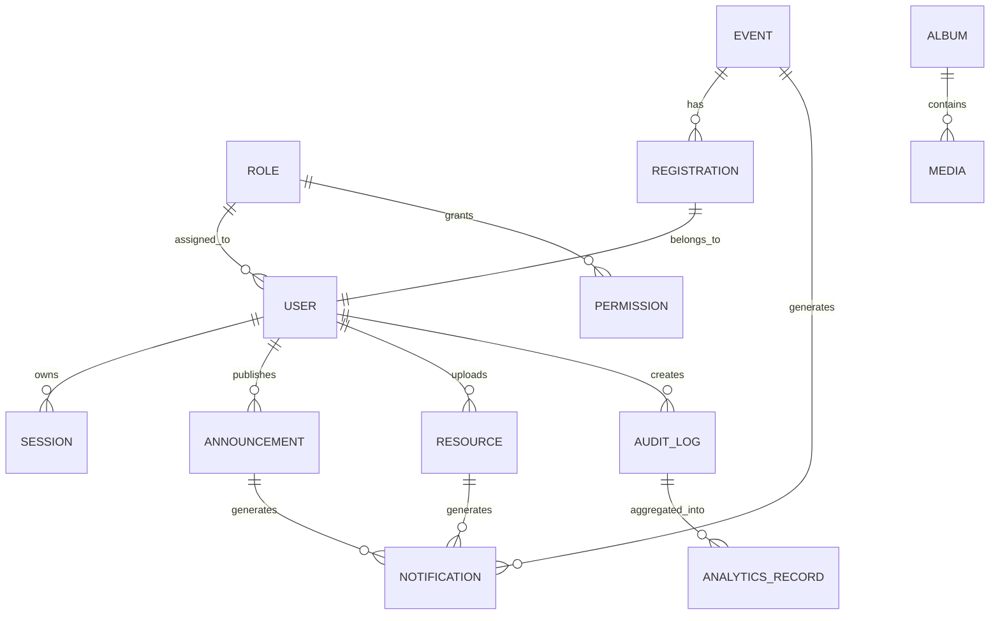

# DDS-004: Data Design

> **Detailed Design Specification (DDS)**
>
> **Reference:** PRD, RHS, IDR, SDS
>
> **Status:** ✅ Approved
>
> **Priority:** 🔴 Critical

---

# 📖 Overview

Dokumen ini mendefinisikan desain data (*Data Design*) untuk Platform Digital Informatika Angkatan 2025.

Data Design menjelaskan bagaimana data dimodelkan pada tingkat konseptual dan logis, bagaimana kepemilikan data ditentukan, hubungan antar entitas, serta prinsip pengelolaan data yang menjadi dasar implementasi database.

Dokumen ini tidak membahas implementasi SQL, migrasi database, maupun optimasi query.

---

# 🎯 Objectives

Data Design bertujuan untuk:

- Mendefinisikan model data utama sistem.
- Menjelaskan hubungan antar entitas.
- Menentukan kepemilikan data pada setiap domain.
- Menjaga konsistensi model data.
- Menjadi acuan implementasi persistence layer.

---

# 📦 Scope

Dokumen ini mencakup:

- Conceptual Data Model
- Logical Data Model
- Core Entities
- Entity Relationships
- Data Ownership
- Data Design Principles

---

# 🏛️ Data Design Overview

Setiap domain memiliki kumpulan entitas yang merepresentasikan kebutuhan bisnis.

Entitas dikelompokkan berdasarkan domain yang memilikinya sehingga tidak terjadi tumpang tindih tanggung jawab.

Model data dirancang untuk:

- Konsisten
- Mudah dipelihara
- Dapat dikembangkan
- Mendukung integritas data
- Mendukung kebutuhan MVP dan pengembangan jangka panjang

---

# 📋 Core Entities

| Domain | Primary Entities |
|----------|-----------------|
| Identity & Access | User, Role, Permission, Session |
| Dashboard | Dashboard Preference, Widget Configuration |
| Official Information | Announcement, Category |
| Schedule | Schedule, Time Slot |
| Knowledge Hub | Resource, Resource Category |
| Event | Event, Registration, Attendance |
| Gallery | Album, Media |
| Notification | Notification, Delivery Record |
| Audit | Audit Log |
| Analytics | Analytics Record |
| Governance | System Configuration |

---

# 🔄 Conceptual Data Relationship



---

# 📂 Entity Ownership

| Entity | Owner Domain |
|----------|--------------|
| User | Identity & Access |
| Role | Identity & Access |
| Permission | Identity & Access |
| Announcement | Official Information |
| Schedule | Schedule |
| Resource | Knowledge Hub |
| Event | Event |
| Registration | Event |
| Album | Gallery |
| Media | Gallery |
| Notification | Notification |
| Audit Log | Audit |
| Analytics Record | Analytics |
| System Configuration | Governance |

---

# 🔒 Data Ownership Principles

Setiap entitas hanya memiliki satu domain sebagai pemilik utama.

Prinsip yang diterapkan:

- Single Source of Truth
- Explicit Ownership
- Encapsulation
- Controlled Access
- Immutable Audit Record

Domain lain hanya dapat mengakses data melalui service atau antarmuka yang telah ditentukan.

---

# 🧩 Logical Data Model Principles

Model data mengikuti prinsip berikut:

- Normalization sesuai kebutuhan domain.
- Menghindari duplikasi data yang tidak diperlukan.
- Referential Integrity.
- Domain Isolation.
- Extensible Data Model.

---

# 🔄 Data Lifecycle

Secara umum setiap data melewati tahapan berikut:

```text
Create
   │
   ▼
Validate
   │
   ▼
Store
   │
   ▼
Update
   │
   ▼
Archive / Delete
```

Setiap perubahan penting terhadap data harus menghasilkan Audit Log sesuai kebijakan sistem.

---

# 🛡️ Data Integrity

Untuk menjaga kualitas data, sistem menerapkan prinsip:

- Validasi sebelum penyimpanan.
- Referential Integrity.
- Audit Logging.
- Versioning apabila diperlukan.
- Konsistensi transaksi.

---

# 🚧 Design Constraints

- Setiap entitas hanya boleh dimiliki oleh satu domain.
- Tidak diperbolehkan akses langsung terhadap data domain lain.
- Data sensitif harus mendapatkan perlindungan sesuai kebijakan keamanan.
- Model data harus dapat berkembang tanpa merusak kompatibilitas domain lain.

---

# 📚 Related Documents

## Previous Documents

- DDS-001: System Design Overview
- DDS-002: Component Design
- DDS-003: Domain Design

## Next Documents

- DDS-005: Interface Design

---

# ✅ Review Checklist

- [ ] Seluruh entitas utama telah diidentifikasi.
- [ ] Kepemilikan data telah ditentukan.
- [ ] Hubungan antar entitas telah dijelaskan.
- [ ] Prinsip desain data telah terdokumentasi.
- [ ] Selaras dengan Domain Design.

---

# 🔄 Traceability Matrix

| Data Area | Related Document |
|------------|------------------|
| Identity Data | RHS-001 |
| Announcement Data | RHS-002 |
| Schedule Data | RHS-004 |
| Resource Data | RHS-005 |
| Event Data | RHS-006 |
| Gallery Data | RHS-007 |
| Notification Data | RHS-011 |
| Audit Data | RHS-012 |
| Analytics Data | RHS-015 |
| Governance Data | RHS-018 |

---

# 🔗 References

## Product Documentation

- [Product Requirements Document (PRD)](../PRD.md)
- [Requirements Hardening Specification (RHS)](../rhs/README.md)
- [Implementation Detail Records (IDR)](../IDR/README.md)
- [Software Design Specification (SDS)](../SDS/README.md)

## Related DDS

- [DDS README](./README.md)
- [DDS-003: Domain Design](./03-dds-003-domain-design.md)
- [DDS-005: Interface Design](./05-dds-005-interface-design.md)

---

# 📝 Revision History

| Version | Date | Description |
|----------|------|-------------|
| 1.0 | 2026-08-06 | Initial Data Design documentation |
