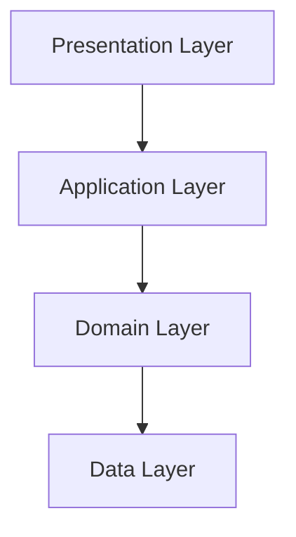
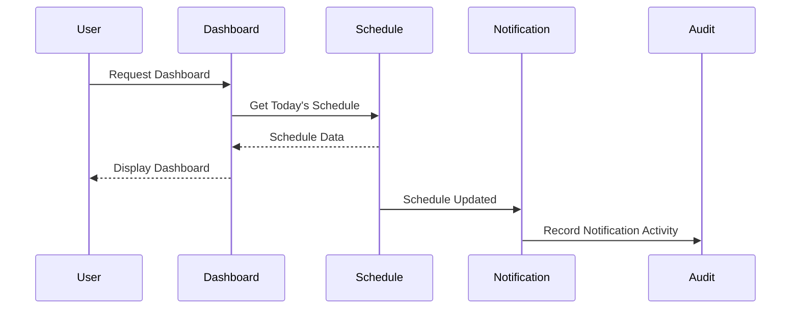

# DDS-005: Interface Design

> **Detailed Design Specification (DDS)**
>
> **Reference:** PRD, RHS, IDR, SDS
>
> **Status:** ✅ Approved
>
> **Priority:** 🔴 Critical

---

# 📖 Overview

Dokumen ini mendefinisikan desain antarmuka (*Interface Design*) untuk Platform Digital Informatika Angkatan 2025.

Interface Design menjelaskan bagaimana komponen, domain, dan lapisan sistem saling berinteraksi melalui kontrak yang jelas. Tujuannya adalah menjaga konsistensi komunikasi antar bagian sistem tanpa menciptakan ketergantungan yang berlebihan.

Dokumen ini tidak membahas spesifikasi endpoint API eksternal maupun desain antarmuka pengguna (UI).

---

# 🎯 Objectives

Interface Design bertujuan untuk:

- Mendefinisikan kontrak komunikasi antar komponen.
- Menjelaskan interaksi antar domain.
- Menentukan batas akses antar lapisan sistem.
- Mengurangi coupling antar modul.
- Menjadi acuan implementasi service dan interface.

---

# 📦 Scope

Dokumen ini mencakup:

- Layer Interfaces
- Domain Interfaces
- Internal Service Contracts
- Communication Principles
- Interface Responsibilities
- Design Constraints

---

# 🏛️ Interface Design Overview

Platform menggunakan pendekatan **Layered Modular Architecture**.

Interaksi antar bagian sistem dilakukan melalui antarmuka (*interfaces*) yang eksplisit sehingga setiap komponen hanya bergantung pada kontrak layanan, bukan implementasi internal.

Prinsip ini memungkinkan perubahan implementasi tanpa memengaruhi komponen lain selama kontrak tetap dipertahankan.

---

# 🧱 Layer Interaction

Setiap lapisan hanya berinteraksi dengan lapisan yang berada tepat di bawahnya.

---

# 🔄 Component Interfaces

| Consumer | Provider | Purpose |
|----------|----------|---------|
| Dashboard | Official Information | Menampilkan pengumuman terbaru |
| Dashboard | Schedule | Menampilkan jadwal hari ini |
| Dashboard | Knowledge Hub | Menampilkan resource terbaru |
| Dashboard | Event | Menampilkan agenda mendatang |
| Official Information | Notification | Mengirim notifikasi publikasi |
| Schedule | Notification | Mengirim notifikasi perubahan jadwal |
| Knowledge Hub | Notification | Mengirim notifikasi resource baru |
| Event | Notification | Mengirim notifikasi kegiatan |
| Semua Domain | Audit | Mencatat aktivitas sistem |
| Audit | Analytics | Menyediakan data agregasi |

---

# 🧩 Internal Service Contracts

Setiap domain menyediakan layanan internal sesuai tanggung jawabnya.

Contoh:

## Identity Service

Responsibilities:

- Authenticate User
- Validate Session
- Check Permission
- Manage User Profile

---

## Schedule Service

Responsibilities:

- Retrieve Schedule
- Manage Schedule
- Publish Schedule Changes

---

## Knowledge Hub Service

Responsibilities:

- Publish Resource
- Search Resource
- Manage Categories

---

## Notification Service

Responsibilities:

- Create Notification
- Queue Notification
- Mark Delivery Status

---

## Audit Service

Responsibilities:

- Record Activity
- Record Changes
- Store Audit Trail

---

# 🔐 Interface Design Principles

Seluruh interface mengikuti prinsip berikut:

- Explicit Contracts
- Loose Coupling
- Dependency Inversion
- Interface Segregation
- Encapsulation
- Backward Compatibility

---

# 🔄 Communication Flow

---

# 📌 Interface Ownership

| Interface | Owner |
|-----------|-------|
| Authentication Interface | Identity & Access |
| Dashboard Interface | Dashboard |
| Announcement Interface | Official Information |
| Schedule Interface | Schedule |
| Knowledge Hub Interface | Knowledge Hub |
| Event Interface | Event |
| Gallery Interface | Gallery |
| Notification Interface | Notification |
| Audit Interface | Audit |
| Analytics Interface | Analytics |

---

# 🚧 Design Constraints

- Komponen hanya boleh berkomunikasi melalui interface yang telah ditentukan.
- Interface tidak boleh mengekspos implementasi internal.
- Kontrak interface harus stabil dan terdokumentasi.
- Perubahan interface harus mempertahankan kompatibilitas selama memungkinkan.

---

# 📚 Related Documents

## Previous Documents

- DDS-001: System Design Overview
- DDS-002: Component Design
- DDS-003: Domain Design
- DDS-004: Data Design

## Next Documents

- DDS-006: Security Design

---

# ✅ Review Checklist

- [ ] Seluruh interface utama telah diidentifikasi.
- [ ] Hubungan antar komponen telah dijelaskan.
- [ ] Prinsip komunikasi telah ditentukan.
- [ ] Tidak terdapat ketergantungan langsung antar implementasi.
- [ ] Selaras dengan arsitektur sistem.

---

# 🔄 Traceability Matrix

| Interface | Related RHS |
|-----------|-------------|
| Authentication | RHS-001 |
| Dashboard | RHS-003 |
| Official Information | RHS-002 |
| Schedule | RHS-004 |
| Knowledge Hub | RHS-005 |
| Event | RHS-006 |
| Gallery | RHS-007 |
| Notification | RHS-011 |
| Audit | RHS-012 |
| Analytics | RHS-015 |

---

# 🔗 References

## Product Documentation

- [Product Requirements Document (PRD)](../PRD.md)
- [Requirements Hardening Specification (RHS)](../rhs/README.md)
- [Implementation Detail Records (IDR)](../IDR/README.md)
- [Software Design Specification (SDS)](../SDS/README.md)

## Related DDS

- [DDS README](./README.md)
- [DDS-004: Data Design](./04-dds-004-data-design.md)
- [DDS-006: Security Design](./06-dds-006-security-design.md)

---

# 📝 Revision History

| Version | Date | Description |
|----------|------|-------------|
| 1.0 | 2026-08-06 | Initial Interface Design documentation |
