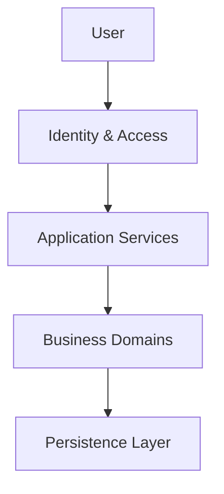

# DDS-006: Security Design

> **Detailed Design Specification (DDS)**
>
> **Reference:** PRD, RHS, IDR, SDS
>
> **Status:** ✅ Approved
>
> **Priority:** 🔴 Critical

---

# 📖 Overview

Dokumen ini mendefinisikan desain keamanan (*Security Design*) untuk Platform Digital Informatika Angkatan 2025.

Security Design menjelaskan bagaimana mekanisme keamanan diterapkan pada tingkat desain sistem, termasuk autentikasi, otorisasi, perlindungan data, batas keamanan antar komponen, serta prinsip keamanan yang harus dipatuhi selama implementasi.

Dokumen ini tidak membahas konfigurasi keamanan server maupun implementasi source code secara rinci.

---

# 🎯 Objectives

Security Design bertujuan untuk:

- Mendefinisikan mekanisme keamanan sistem.
- Menjelaskan model autentikasi dan otorisasi.
- Menentukan batas keamanan antar komponen.
- Melindungi data dan identitas pengguna.
- Menjadi acuan implementasi fitur keamanan.

---

# 📦 Scope

Dokumen ini mencakup:

- Authentication Design
- Authorization Design
- Security Boundaries
- Data Protection
- Session Management
- Audit & Accountability

---

# 🏛️ Security Architecture Overview

Platform menerapkan prinsip **Security by Design**, di mana keamanan menjadi bagian dari proses desain sejak awal pengembangan.

Seluruh komponen harus mematuhi kebijakan keamanan yang konsisten dan tidak diperbolehkan melewati mekanisme autentikasi maupun otorisasi yang telah ditetapkan.

---

# 🔐 Authentication Design

Authentication bertanggung jawab memastikan identitas pengguna sebelum mengakses sistem.

Mekanisme autentikasi mencakup:

- Login
- Logout
- Session Validation
- Password Verification
- First Login Password Change

Seluruh proses autentikasi dikelola oleh domain **Identity & Access**.

---

# 👤 Authorization Design

Authorization menentukan hak akses pengguna berdasarkan peran (*Role-Based Access Control / RBAC*).

Hak akses diberikan berdasarkan:

- Role
- Permission
- Resource
- Action

Contoh tindakan:

- Read
- Create
- Update
- Delete
- Publish
- Approve

---

# 🔒 Security Boundaries

Seluruh akses ke Business Domains harus melewati proses autentikasi dan otorisasi.

---

# 🛡️ Data Protection

Data dikelompokkan berdasarkan tingkat sensitivitas.

| Data Type | Protection |
|-----------|------------|
| User Identity | High |
| Authentication Credentials | Critical |
| Official Information | Medium |
| Schedule | Medium |
| Knowledge Resources | Medium |
| Audit Logs | High |
| Analytics | Medium |
| Public Gallery | Low |

---

# 🔄 Session Management

Prinsip pengelolaan sesi:

- Session hanya dibuat setelah autentikasi berhasil.
- Session harus dapat divalidasi.
- Session dapat diakhiri oleh pengguna.
- Session yang tidak aktif harus berakhir sesuai kebijakan sistem.

---

# 📋 Audit & Accountability

Seluruh aktivitas penting harus dicatat.

Contoh aktivitas:

- Login
- Logout
- Password Change
- Publish Announcement
- Update Schedule
- Publish Resource
- Role Change
- Configuration Change

Audit Log digunakan untuk:

- Investigasi
- Monitoring
- Kepatuhan
- Pelacakan perubahan

---

# 🧩 Security Principles

Seluruh implementasi keamanan mengikuti prinsip:

- Security by Design
- Least Privilege
- Defense in Depth
- Fail Secure
- Secure Defaults
- Separation of Duties
- Accountability

---

# 🚧 Design Constraints

- Tidak ada akses tanpa autentikasi kecuali untuk sumber daya yang memang dipublikasikan sebagai informasi umum.
- Seluruh keputusan otorisasi harus melalui mekanisme yang terdokumentasi.
- Data sensitif tidak boleh diekspos kepada pengguna yang tidak berwenang.
- Setiap perubahan hak akses harus dapat diaudit.

---

# 📚 Related Documents

## Previous Documents

- DDS-001: System Design Overview
- DDS-002: Component Design
- DDS-003: Domain Design
- DDS-004: Data Design
- DDS-005: Interface Design

## Next Documents

- DDS-007: Design Decisions

---

# ✅ Review Checklist

- [ ] Mekanisme autentikasi telah dijelaskan.
- [ ] Model otorisasi telah ditentukan.
- [ ] Batas keamanan sistem telah didefinisikan.
- [ ] Perlindungan data telah dijelaskan.
- [ ] Audit dan akuntabilitas telah dipertimbangkan.

---

# 🔄 Traceability Matrix

| Security Area | Related Document |
|---------------|------------------|
| Authentication | RHS-001 |
| Authorization | RHS-001 |
| Data Protection | SDS-006 |
| Audit Logging | RHS-012 |
| Analytics Security | RHS-015 |
| Governance | RHS-018 |

---

# 🔗 References

## Product Documentation

- [Product Requirements Document (PRD)](../PRD.md)
- [Requirements Hardening Specification (RHS)](../rhs/README.md)
- [Implementation Detail Records (IDR)](../IDR/README.md)
- [Software Design Specification (SDS)](../SDS/README.md)

## Related DDS

- [DDS README](./README.md)
- [DDS-005: Interface Design](./05-dds-005-interface-design.md)
- [DDS-007: Design Decisions](./07-dds-007-design-decisions.md)

---

# 📝 Revision History

| Version | Date | Description |
|----------|------|-------------|
| 1.0 | 2026-08-07 | Initial Security Design documentation |
