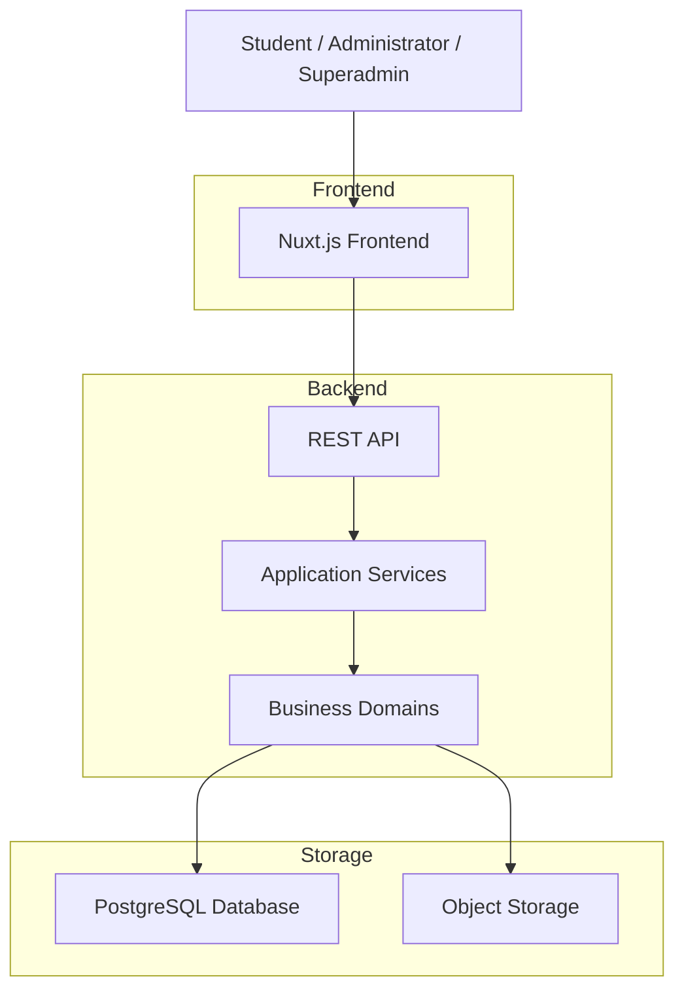

# SDS-004: High-Level Architecture

> **Software Design Specification (SDS)**
>
> **Reference:** PRD, RHS, IDR
>
> **Status:** ✅ Approved
>
> **Priority:** 🔴 Critical

---

# 📖 Overview

Dokumen ini mendefinisikan **High-Level Architecture** Platform Digital Informatika Angkatan 2025.

High-Level Architecture menggambarkan bagaimana komponen utama sistem saling berinteraksi secara konseptual tanpa membahas implementasi teknis setiap modul.

Arsitektur ini menjadi dasar implementasi seluruh komponen perangkat lunak dan memastikan setiap domain memiliki tanggung jawab yang jelas sesuai dengan Architecture Principles yang telah ditetapkan.

---

# 🎯 Objectives

High-Level Architecture bertujuan untuk:

- Menjelaskan struktur arsitektur sistem secara keseluruhan.
- Mendefinisikan lapisan (layers) utama aplikasi.
- Menentukan arah komunikasi antar komponen.
- Mengurangi kompleksitas implementasi.
- Menjadi acuan bagi seluruh Engineering Team.

---

# 📦 Scope

Dokumen ini mencakup:

- Architecture Style
- Logical Architecture
- Layer Responsibilities
- High-Level Component Interaction
- Dependency Direction
- Architectural Constraints

Dokumen ini tidak membahas implementasi source code maupun desain rinci setiap domain.

---

# 🏛️ Architecture Style

Platform Digital Informatika Angkatan 2025 menggunakan pendekatan **Modular Monolith**.

Pendekatan ini dipilih karena:

- Sesuai dengan ruang lingkup MVP.
- Lebih sederhana dibanding arsitektur microservices.
- Mudah dikembangkan oleh tim kecil.
- Mempermudah proses deployment.
- Mengurangi kompleksitas operasional.

Walaupun dijalankan sebagai satu aplikasi, setiap domain bisnis tetap dipisahkan berdasarkan tanggung jawabnya sehingga memungkinkan pengembangan yang lebih terstruktur.

---

# 🧱 Logical Architecture

Sistem dibagi menjadi empat lapisan utama.

| Layer | Responsibility |
|--------|----------------|
| Presentation Layer | Menyediakan antarmuka pengguna dan menerima interaksi dari client. |
| Application Layer | Mengelola proses bisnis dan mengoordinasikan layanan aplikasi. |
| Domain Layer | Menjalankan aturan bisnis dan logika utama sistem. |
| Data Layer | Mengelola penyimpanan data serta akses terhadap database dan object storage. |

---

# 🏗️ High-Level Architecture



---

# 🧩 Layer Responsibilities

## Presentation Layer

Bertanggung jawab terhadap:

- User Interface
- Navigation
- Form Validation
- User Interaction

Layer ini tidak menyimpan business logic.

---

## Application Layer

Bertanggung jawab terhadap:

- Request Processing
- Use Case Execution
- Transaction Coordination
- Service Orchestration

Layer ini menjadi penghubung antara Presentation Layer dan Domain Layer.

---

## Domain Layer

Bertanggung jawab terhadap:

- Business Rules
- Business Validation
- Domain Services
- Domain Models

Seluruh aturan bisnis utama berada pada lapisan ini.

---

## Data Layer

Bertanggung jawab terhadap:

- Database Access
- File Storage Access
- Data Persistence
- Repository Implementation

Layer ini tidak diperbolehkan mengandung business logic.

---

# 🔄 Dependency Direction

Ketergantungan antar layer mengikuti arah berikut.

```text
Presentation Layer
        │
        ▼
Application Layer
        │
        ▼
Domain Layer
        │
        ▼
Data Layer
```

Layer yang lebih rendah tidak boleh bergantung pada layer yang berada di atasnya.

---

# 🏛️ Architectural Characteristics

High-Level Architecture memiliki karakteristik berikut:

- Modular
- Maintainable
- Scalable
- Secure
- Reliable
- Extensible
- Consistent
- Audit-Friendly

---

# 🚧 Architecture Constraints

Selama implementasi, arsitektur harus memenuhi ketentuan berikut:

- Domain bisnis harus tetap terpisah.
- Business logic tidak boleh berada pada Presentation Layer.
- Akses database hanya melalui mekanisme yang telah ditetapkan.
- Komunikasi antar layer harus mengikuti dependency direction.
- Perubahan pada satu domain tidak boleh menyebabkan perubahan besar pada domain lain.

---

# 📚 Related Documents

## Previous Documents

- SDS-001: System Overview
- SDS-002: Architecture Principles
- SDS-003: Technology Stack

## Next Documents

- SDS-005: Domain & Module Design
- SDS-006: Architecture Constraints

---

# ✅ Review Checklist

- [ ] Architecture Style telah ditentukan.
- [ ] Logical Architecture telah dijelaskan.
- [ ] Layer Responsibilities telah didefinisikan.
- [ ] Dependency Direction telah ditetapkan.
- [ ] High-Level Architecture sesuai dengan ruang lingkup MVP.

---

# 🔄 Traceability Matrix

| Architecture Element | Related Document |
|----------------------|------------------|
| Architecture Style | IDR-001 Project Architecture |
| Logical Layers | IDR-001 Project Architecture |
| Technology Selection | IDR-002 Technology Stack |
| Authentication Layer | RHS-001 Authentication |
| Dashboard | RHS-003 Dashboard |
| Official Information | RHS-002 Official Information |
| Schedule | RHS-004 Schedule |
| Knowledge Hub | RHS-005 Knowledge Hub |
| Notification | RHS-011 Notification |
| Audit | RHS-012 Audit Log |

---

# 🔗 References

## Product Documentation

- [Product Requirements Document (PRD)](../PRD.md)
- [Requirements Hardening Specification (RHS)](../rhs/README.md)
- [Implementation Detail Records (IDR)](../IDR/README.md)

## Related SDS

- [SDS README](./README.md)
- [SDS-003: Technology Stack](./03-sds-003-technology-stack.md)
- [SDS-005: Domain & Module Design](./05-sds-005-domain-module-design.md)

---

# 📝 Revision History

| Version | Date | Description |
|----------|------|-------------|
| 1.0 | 2026-08-02 | Initial High-Level Architecture documentation |
