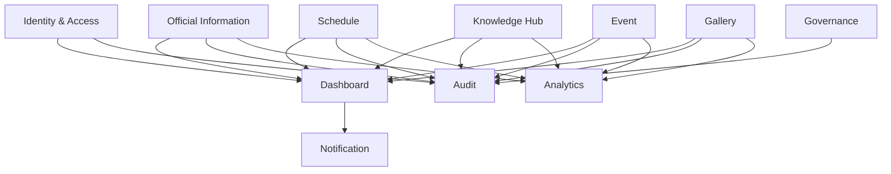

# SDS-005: Domain & Module Design

> **Software Design Specification (SDS)**
>
> **Reference:** PRD, RHS, IDR
>
> **Status:** ✅ Approved
>
> **Priority:** 🔴 Critical

---

# 📖 Overview

Dokumen ini mendefinisikan domain bisnis dan modul utama pada Platform Digital Informatika Angkatan 2025.

Domain & Module Design bertujuan untuk membagi sistem menjadi beberapa area tanggung jawab (*bounded context*) sehingga setiap modul memiliki fungsi yang jelas, mudah dipelihara, dan dapat dikembangkan tanpa memengaruhi keseluruhan sistem secara signifikan.

Dokumen ini hanya menjelaskan identifikasi domain pada tingkat arsitektur dan tidak membahas implementasi teknis masing-masing modul.

---

# 🎯 Objectives

Domain & Module Design bertujuan untuk:

- Mengidentifikasi domain utama sistem.
- Mendefinisikan batas tanggung jawab setiap modul.
- Mengurangi ketergantungan antar modul.
- Mendukung pengembangan secara modular.
- Menjadi acuan implementasi bagi Engineering Team.

---

# 📦 Scope

Dokumen ini mencakup:

- Domain Identification
- Module Responsibilities
- Domain Relationships
- Dependency Principles

---

# 🏛️ Domain Identification

Platform Digital Informatika Angkatan 2025 terdiri atas domain utama berikut.

| Domain | Description |
|----------|-------------|
| Identity & Access | Mengelola autentikasi, otorisasi, onboarding, dan siklus hidup akun. |
| Official Information | Mengelola informasi resmi yang dipublikasikan kepada mahasiswa. |
| Dashboard | Menyediakan ringkasan informasi utama berdasarkan hak akses pengguna. |
| Schedule | Mengelola jadwal akademik dan kegiatan. |
| Knowledge Hub | Mengelola repository materi pembelajaran dan sumber daya. |
| Event | Mengelola informasi kegiatan dan agenda angkatan. |
| Gallery | Mengelola dokumentasi foto dan media kegiatan. |
| Notification | Mengelola penyampaian notifikasi kepada pengguna. |
| Audit | Mencatat aktivitas penting sistem. |
| Analytics | Mengumpulkan metrik penggunaan sistem. |
| Governance | Mendukung administrasi operasional dan tata kelola platform. |

---

# 🧩 Module Responsibilities

| Module | Primary Responsibility |
|----------|-----------------------|
| Identity & Access | Authentication, Authorization, Account Management |
| Official Information | Publication Management |
| Dashboard | Information Aggregation |
| Schedule | Schedule Management |
| Knowledge Hub | Resource Management |
| Event | Event Management |
| Gallery | Media Management |
| Notification | Notification Delivery |
| Audit | Activity Logging |
| Analytics | Usage Analytics |
| Governance | System Administration |

---

# 🔄 Domain Relationships

Hubungan antar domain digambarkan sebagai berikut.

---

# 🏗️ Domain Design Principles

Setiap domain mengikuti prinsip berikut.

## Separation of Concerns

Setiap domain hanya bertanggung jawab terhadap proses bisnisnya sendiri.

---

## High Cohesion

Fungsi yang saling berkaitan ditempatkan pada domain yang sama.

---

## Low Coupling

Ketergantungan antar domain dijaga seminimal mungkin.

---

## Single Responsibility

Setiap domain memiliki satu tujuan utama.

---

## Extensibility

Penambahan domain baru tidak boleh memengaruhi domain yang telah ada secara signifikan.

---

# 🔄 Dependency Principles

Hubungan antar domain harus mengikuti ketentuan berikut.

- Domain tidak mengakses penyimpanan data domain lain secara langsung.
- Komunikasi antar domain dilakukan melalui mekanisme yang telah ditentukan pada arsitektur aplikasi.
- Dashboard berperan sebagai agregator informasi dan bukan sebagai sumber data utama.
- Audit dan Analytics menerima data aktivitas dari domain lain tanpa mengambil alih logika bisnis domain tersebut.

---

# 🚧 Design Constraints

Selama implementasi, domain harus memenuhi ketentuan berikut.

- Tidak terjadi duplikasi tanggung jawab.
- Domain memiliki batas yang jelas.
- Penambahan fitur baru mengikuti domain yang sesuai.
- Perubahan pada satu domain tidak mengharuskan perubahan besar pada domain lainnya.

---

# 📚 Related Documents

## Previous Documents

- SDS-001: System Overview
- SDS-002: Architecture Principles
- SDS-003: Technology Stack
- SDS-004: High-Level Architecture

## Related RHS

- RHS-001 Authentication
- RHS-002 Official Information
- RHS-003 Dashboard
- RHS-004 Schedule
- RHS-005 Knowledge Hub
- RHS-006 Event & Gallery
- RHS-011 Notification
- RHS-012 Audit Log
- RHS-015 Analytics
- RHS-016 Governance

---

# ✅ Review Checklist

- [ ] Seluruh domain telah diidentifikasi.
- [ ] Tanggung jawab setiap modul telah didefinisikan.
- [ ] Hubungan antar domain telah dijelaskan.
- [ ] Domain mengikuti Architecture Principles.
- [ ] Desain sesuai dengan ruang lingkup MVP.

---

# 🔄 Traceability Matrix

| Domain | Related Requirement |
|----------|--------------------|
| Identity & Access | RHS-001 |
| Official Information | RHS-002 |
| Dashboard | RHS-003 |
| Schedule | RHS-004 |
| Knowledge Hub | RHS-005 |
| Event | RHS-006 |
| Gallery | RHS-006 |
| Notification | RHS-011 |
| Audit | RHS-012 |
| Analytics | RHS-015 |
| Governance | RHS-016 |

---

# 🔗 References

## Product Documentation

- [Product Requirements Document (PRD)](../PRD.md)
- [Requirements Hardening Specification (RHS)](../rhs/README.md)
- [Implementation Detail Records (IDR)](../IDR/README.md)

## Related SDS

- [SDS README](./README.md)
- [SDS-004: High-Level Architecture](./04-sds-004-high-level-architecture.md)
- [SDS-006: Architecture Constraints](./06-sds-006-architecture-constraints.md)

---

# 📝 Revision History

| Version | Date | Description |
|----------|------|-------------|
| 1.0 | 2026-08-02 | Initial Domain & Module Design documentation |
