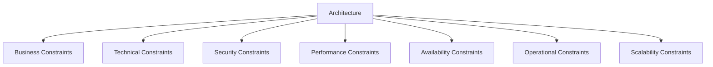

# SDS-006: Architecture Constraints

> **Software Design Specification (SDS)**
>
> **Reference:** PRD, RHS, IDR
>
> **Status:** ✅ Approved
>
> **Priority:** 🔴 Critical

---

# 📖 Overview

Dokumen ini mendefinisikan batasan arsitektur (*Architecture Constraints*) yang harus dipatuhi selama proses pengembangan Platform Digital Informatika Angkatan 2025.

Architecture Constraints bertujuan menjaga konsistensi implementasi sehingga seluruh komponen sistem tetap sesuai dengan prinsip arsitektur yang telah ditetapkan pada Software Design Specification.

Seluruh keputusan desain maupun implementasi harus mempertimbangkan batasan-batasan yang dijelaskan pada dokumen ini.

---

# 🎯 Objectives

Architecture Constraints bertujuan untuk:

- Menjaga konsistensi implementasi arsitektur.
- Mengurangi risiko penyimpangan desain.
- Menjamin maintainability sistem.
- Mendukung keamanan dan keandalan aplikasi.
- Menjadi acuan seluruh Engineering Team selama pengembangan.

---

# 📦 Scope

Dokumen ini mencakup:

- Business Constraints
- Technical Constraints
- Security Constraints
- Performance Constraints
- Availability Constraints
- Operational Constraints
- Scalability Constraints

---

# 🏛️ Business Constraints

## BC-01 — MVP Scope

Implementasi hanya mencakup fitur yang telah ditetapkan pada ruang lingkup MVP.

Penambahan fitur baru harus melalui proses perubahan requirement yang sesuai.

---

## BC-02 — Single Source of Truth

Seluruh informasi resmi hanya memiliki satu sumber data yang dianggap valid.

Tidak diperbolehkan terdapat duplikasi data yang menyebabkan inkonsistensi.

---

## BC-03 — Governance

Pengelolaan sistem harus mengikuti kebijakan tata kelola yang telah ditetapkan pada dokumentasi Governance.

---

# ⚙️ Technical Constraints

## TC-01 — Modular Architecture

Sistem harus mempertahankan pendekatan Modular Monolith.

---

## TC-02 — Layer Separation

Business Logic tidak boleh ditempatkan pada Presentation Layer.

---

## TC-03 — Dependency Direction

Ketergantungan antar layer harus mengikuti arah yang telah ditetapkan pada High-Level Architecture.

---

## TC-04 — Shared Components

Komponen bersama harus digunakan kembali (*reusable*) dan tidak boleh diduplikasi.

---

# 🔐 Security Constraints

## SC-01

Seluruh komunikasi client dan server harus menggunakan HTTPS.

---

## SC-02

Password harus disimpan menggunakan algoritma hashing yang aman.

---

## SC-03

Hak akses harus mengikuti prinsip Least Privilege.

---

## SC-04

Validasi input dilakukan sebelum diproses oleh Business Layer.

---

## SC-05

Audit Log harus mencatat aktivitas penting sesuai kebijakan Audit Log.

---

# ⚡ Performance Constraints

## PC-01

Arsitektur harus mendukung performa yang memadai untuk ruang lingkup MVP.

---

## PC-02

Proses yang membutuhkan waktu lama harus dipisahkan dari proses utama apabila memungkinkan.

---

## PC-03

Query terhadap database harus dirancang secara efisien.

---

# 🌐 Availability Constraints

## AC-01

Sistem harus dirancang agar tetap tersedia sesuai target availability yang telah ditentukan.

---

## AC-02

Gangguan pada satu modul tidak boleh menyebabkan kegagalan total apabila masih dapat diisolasi.

---

## AC-03

Backup dan Recovery mengikuti kebijakan yang telah ditetapkan pada dokumentasi terkait.

---

# 🛠️ Operational Constraints

## OC-01

Seluruh konfigurasi aplikasi harus dapat dikelola tanpa mengubah source code.

---

## OC-02

Environment Development, Staging, dan Production harus dipisahkan.

---

## OC-03

Seluruh perubahan mengikuti workflow pengembangan yang telah ditetapkan.

---

# 📈 Scalability Constraints

## SSC-01

Penambahan modul baru tidak boleh memerlukan perubahan besar pada arsitektur inti.

---

## SSC-02

Domain bisnis harus dapat berkembang secara independen.

---

## SSC-03

Arsitektur harus memungkinkan penambahan layanan pendukung di masa mendatang tanpa mengubah fondasi sistem.

---

# 🔄 Constraint Relationships

---

# 📚 Related Documents

## Previous Documents

- SDS-001: System Overview
- SDS-002: Architecture Principles
- SDS-003: Technology Stack
- SDS-004: High-Level Architecture
- SDS-005: Domain & Module Design

## Related Documents

- RHS-009 Security
- RHS-013 Backup & Recovery
- RHS-014 Performance
- IDR-001 Project Architecture
- IDR-012 Deployment Strategy
- IDR-015 Security Architecture

---

# ✅ Review Checklist

- [ ] Business Constraints telah didefinisikan.
- [ ] Technical Constraints telah dijelaskan.
- [ ] Security Constraints telah ditetapkan.
- [ ] Performance Constraints telah ditentukan.
- [ ] Availability Constraints telah dijelaskan.
- [ ] Operational Constraints telah ditetapkan.
- [ ] Scalability Constraints telah dipertimbangkan.

---

# 🔄 Traceability Matrix

| Constraint Category | Related Document |
|---------------------|------------------|
| Business Constraints | PRD |
| Technical Constraints | IDR-001 |
| Security Constraints | RHS-009 |
| Performance Constraints | RHS-014 |
| Availability Constraints | RHS-013 |
| Operational Constraints | IDR-012 |
| Scalability Constraints | SDS-002 Architecture Principles |

---

# 🔗 References

## Product Documentation

- [Product Requirements Document (PRD)](../PRD.md)
- [Requirements Hardening Specification (RHS)](../RHS/README.md)
- [Implementation Detail Records (IDR)](../IDR/README.md)

## Related SDS

- [SDS README](./README.md)
- [SDS-005: Domain & Module Design](./05-sds-005-domain-module-design.md)
- [SDS-007: External Dependencies](./07-sds-007-external-dependencies.md)

---

# 📝 Revision History

| Version | Date | Description |
|----------|------|-------------|
| 1.0 | 2026-08-02 | Initial Architecture Constraints documentation |
