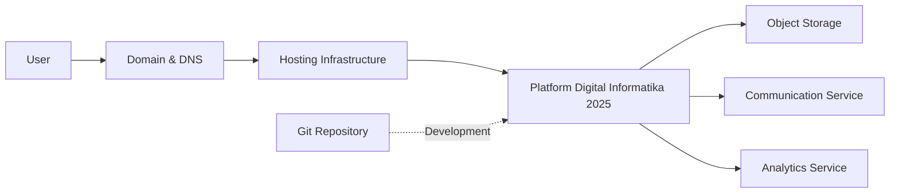

# SDS-007: External Dependencies

> **Software Design Specification (SDS)**
>
> **Reference:** PRD, RHS, IDR
>
> **Status:** ✅ Approved
>
> **Priority:** 🟠 High

---

# 📖 Overview

Dokumen ini mendefinisikan seluruh layanan eksternal (*External Dependencies*) yang digunakan oleh Platform Digital Informatika Angkatan 2025.

External Dependencies merupakan layanan di luar sistem utama yang mendukung operasional aplikasi, seperti penyimpanan file, penyedia domain, layanan hosting, maupun layanan komunikasi.

Dokumen ini tidak membahas konfigurasi teknis masing-masing layanan, melainkan mendefinisikan hubungan dan peran layanan eksternal terhadap arsitektur sistem.

---

# 🎯 Objectives

External Dependencies bertujuan untuk:

- Mengidentifikasi seluruh layanan eksternal yang digunakan sistem.
- Menjelaskan fungsi masing-masing layanan.
- Mendokumentasikan tingkat ketergantungan sistem.
- Mengidentifikasi risiko apabila layanan eksternal mengalami gangguan.
- Menjadi referensi implementasi integrasi.

---

# 📦 Scope

Dokumen ini mencakup:

- Hosting Infrastructure
- Domain & DNS
- Object Storage
- Source Code Repository
- Communication Services
- External Analytics
- Dependency Classification

---

# 🏛️ External Dependencies

## Hosting Infrastructure

Hosting Infrastructure digunakan untuk menjalankan aplikasi frontend, backend, database, serta layanan pendukung lainnya.

### Responsibilities

- Menjalankan aplikasi
- Menyediakan resource komputasi
- Menjamin ketersediaan layanan
- Mendukung deployment aplikasi

---

## Domain & DNS

Domain digunakan sebagai identitas utama aplikasi yang diakses oleh pengguna.

DNS bertanggung jawab mengarahkan permintaan pengguna menuju infrastruktur yang sesuai.

### Responsibilities

- Domain Resolution
- DNS Management
- SSL/TLS Support

---

## Object Storage

Object Storage digunakan untuk menyimpan file yang diunggah pengguna maupun aset media aplikasi.

Contoh data yang disimpan:

- Gambar
- Dokumen
- Resource Knowledge Hub
- Media Gallery

---

## Source Code Repository

Repository digunakan sebagai pusat pengelolaan source code dan dokumentasi proyek.

### Responsibilities

- Version Control
- Collaboration
- Source Management
- Documentation Management

---

## Communication Services

Layanan komunikasi digunakan untuk mendukung penyampaian informasi kepada pengguna.

Pada ruang lingkup MVP, komunikasi dapat dilakukan melalui:

- In-App Notification
- WhatsApp Notification (apabila diimplementasikan)

---

## External Analytics

Analytics digunakan untuk memperoleh informasi mengenai penggunaan aplikasi.

Data analytics digunakan untuk:

- Monitoring penggunaan
- Evaluasi operasional
- Pengembangan fitur berikutnya

Analytics tidak digunakan untuk mengubah perilaku sistem secara otomatis pada ruang lingkup MVP.

---

# 📊 Dependency Classification

| Dependency | Category | Criticality |
|------------|----------|-------------|
| Hosting Infrastructure | Infrastructure | Critical |
| Domain & DNS | Infrastructure | Critical |
| Object Storage | Storage | High |
| Source Code Repository | Development | High |
| Communication Services | Integration | Medium |
| External Analytics | Monitoring | Medium |

---

# 🔄 External Dependency Diagram

---

# ⚠️ Dependency Risks

| Dependency | Potential Risk | Mitigation |
|------------|----------------|------------|
| Hosting Infrastructure | Server downtime | Backup & Recovery Plan |
| Domain & DNS | DNS misconfiguration | DNS monitoring dan backup configuration |
| Object Storage | File unavailable | Redundant storage dan backup |
| Repository | Repository unavailable | Local clone dan repository backup |
| Communication Services | Notification gagal dikirim | Retry mechanism dan fallback notification |
| Analytics | Data monitoring tidak tersedia | Monitoring internal aplikasi |

---

# 🛡️ Design Considerations

Seluruh integrasi terhadap layanan eksternal harus memenuhi prinsip berikut:

- Loose Coupling
- Secure Communication
- Failure Isolation
- Configurable Integration
- Vendor Independence (apabila memungkinkan)

---

# 🚧 Constraints

- Layanan eksternal tidak boleh menjadi tempat penyimpanan business logic.
- Kegagalan satu layanan eksternal tidak boleh menyebabkan kerusakan data utama.
- Konfigurasi layanan eksternal harus dipisahkan dari source code.
- Integrasi harus dapat diperbarui tanpa mengubah arsitektur inti.

---

# 📚 Related Documents

## Previous Documents

- SDS-001: System Overview
- SDS-002: Architecture Principles
- SDS-003: Technology Stack
- SDS-004: High-Level Architecture
- SDS-005: Domain & Module Design
- SDS-006: Architecture Constraints

## Related IDR

- IDR-002 Technology Stack
- IDR-012 Deployment Strategy
- IDR-013 CI/CD Pipeline
- IDR-014 Backup & Disaster Recovery
- IDR-015 Security Architecture

---

# ✅ Review Checklist

- [ ] Seluruh layanan eksternal telah diidentifikasi.
- [ ] Tingkat ketergantungan telah diklasifikasikan.
- [ ] Risiko utama telah didokumentasikan.
- [ ] Strategi mitigasi telah didefinisikan.
- [ ] Integrasi tetap sesuai ruang lingkup MVP.

---

# 🔄 Traceability Matrix

| External Dependency | Related Document |
|---------------------|------------------|
| Hosting Infrastructure | IDR-012 Deployment Strategy |
| Domain & DNS | IDR-012 Deployment Strategy |
| Object Storage | IDR-010 File Storage Strategy |
| Source Code Repository | IDR-004 Development Workflow |
| Communication Services | RHS-011 Notification |
| External Analytics | RHS-015 Analytics |

---

# 🔗 References

## Product Documentation

- [Product Requirements Document (PRD)](../PRD.md)
- [Requirements Hardening Specification (RHS)](../rhs/README.md)
- [Implementation Detail Records (IDR)](../IDR/README.md)

## Related SDS

- [SDS README](./README.md)
- [SDS-006: Architecture Constraints](./06-sds-006-architecture-constraints.md)
- [SDS-008: Architecture Decisions](./08-sds-008-architecture-decisions.md)

---

# 📝 Revision History

| Version | Date | Description |
|----------|------|-------------|
| 1.0 | 2026-08-02 | Initial External Dependencies documentation |
