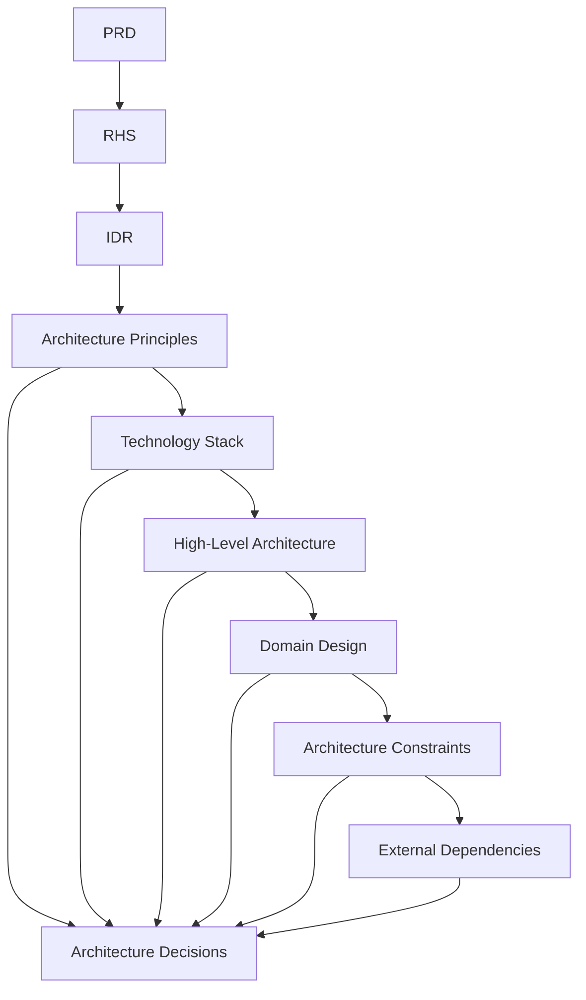

# SDS-008: Architecture Decisions

> **Software Design Specification (SDS)**
>
> **Reference:** PRD, RHS, IDR
>
> **Status:** ✅ Approved
>
> **Priority:** 🟠 High

---

# 📖 Overview

Dokumen ini mendokumentasikan keputusan-keputusan arsitektur (*Architecture Decisions*) yang menjadi dasar pengembangan Platform Digital Informatika Angkatan 2025.

Architecture Decisions merupakan ringkasan keputusan desain yang telah ditetapkan pada dokumen Software Design Specification. Tujuannya adalah memastikan seluruh Engineering Team memahami alasan di balik pendekatan arsitektur yang dipilih serta menjaga konsistensi implementasi selama siklus pengembangan.

Dokumen ini tidak memperkenalkan keputusan baru, melainkan mengonsolidasikan keputusan yang telah ditetapkan pada dokumen SDS sebelumnya.

---

# 🎯 Objectives

Architecture Decisions bertujuan untuk:

- Mendokumentasikan keputusan arsitektur utama.
- Menjelaskan alasan pemilihan pendekatan desain.
- Menjadi referensi bagi Engineering Team.
- Mengurangi inkonsistensi implementasi.
- Menjadi dasar evaluasi perubahan arsitektur di masa mendatang.

---

# 📦 Scope

Dokumen ini mencakup:

- Architecture Style Decisions
- Technology Decisions
- Security Decisions
- Data Management Decisions
- Deployment Decisions
- Operational Decisions

---

# 🏗️ Architecture Decisions

## AD-01 — Modular Monolith Architecture

### Decision

Platform menggunakan pendekatan **Modular Monolith** sebagai arsitektur utama.

### Rationale

- Sesuai dengan ruang lingkup MVP.
- Lebih sederhana dibandingkan Microservices.
- Mudah dikembangkan oleh tim kecil.
- Mengurangi kompleksitas deployment.
- Mempermudah proses pemeliharaan.

### Related Documents

- SDS-002
- SDS-004
- IDR-001

---

## AD-02 — Layered Architecture

### Decision

Sistem menggunakan pemisahan lapisan:

- Presentation Layer
- Application Layer
- Domain Layer
- Data Layer

### Rationale

- Separation of Concerns.
- Maintainability.
- Testability.
- Konsistensi implementasi.

### Related Documents

- SDS-004

---

## AD-03 — Technology Stack

### Decision

Teknologi utama yang digunakan:

| Area | Technology |
|------|------------|
| Frontend | Nuxt.js |
| Backend | Go (Golang) |
| Database | PostgreSQL |
| Styling | Tailwind CSS |
| Container | Docker |
| Repository | GitHub |

### Rationale

Pemilihan teknologi mempertimbangkan:

- Stabilitas.
- Komunitas.
- Maintainability.
- Dukungan jangka panjang.
- Kesesuaian dengan kebutuhan MVP.

### Related Documents

- SDS-003
- IDR-002

---

## AD-04 — Authentication Strategy

### Decision

Autentikasi mengikuti mekanisme yang telah ditetapkan pada RHS.

### Rationale

- Security by Design.
- Least Privilege.
- Auditability.

### Related Documents

- RHS-001
- RHS-008
- RHS-009

---

## AD-05 — Domain Separation

### Decision

Business Domain dipisahkan berdasarkan tanggung jawab.

### Rationale

- High Cohesion.
- Low Coupling.
- Kemudahan pengembangan.
- Kemudahan pengujian.

### Related Documents

- SDS-005

---

## AD-06 — Single Source of Truth

### Decision

Seluruh informasi resmi hanya memiliki satu sumber data.

### Rationale

- Menghindari inkonsistensi.
- Mempermudah validasi.
- Menjaga integritas data.

### Related Documents

- PRD
- RHS-002
- SDS-002

---

## AD-07 — Security by Design

### Decision

Keamanan menjadi bagian dari proses desain sejak awal.

### Rationale

- Mengurangi risiko keamanan.
- Mendukung audit.
- Melindungi data pengguna.

### Related Documents

- SDS-002
- SDS-006
- RHS-009

---

## AD-08 — External Services

### Decision

Layanan eksternal hanya digunakan sebagai layanan pendukung.

### Rationale

- Mengurangi ketergantungan.
- Mempermudah migrasi.
- Menjaga fleksibilitas sistem.

### Related Documents

- SDS-007

---

# 📊 Architecture Decision Summary

| Decision | Status |
|----------|--------|
| Modular Monolith | ✅ Approved |
| Layered Architecture | ✅ Approved |
| Technology Stack | ✅ Approved |
| Authentication Strategy | ✅ Approved |
| Domain Separation | ✅ Approved |
| Single Source of Truth | ✅ Approved |
| Security by Design | ✅ Approved |
| External Services | ✅ Approved |

---

# 🔄 Decision Relationships

---

# 🚧 Change Management

Perubahan terhadap Architecture Decisions harus memenuhi ketentuan berikut:

- Memiliki justifikasi teknis yang jelas.
- Tidak bertentangan dengan PRD.
- Tidak bertentangan dengan RHS.
- Tidak bertentangan dengan IDR.
- Didokumentasikan melalui proses perubahan yang sesuai.

---

# 📚 Related Documents

## Previous Documents

- SDS-001: System Overview
- SDS-002: Architecture Principles
- SDS-003: Technology Stack
- SDS-004: High-Level Architecture
- SDS-005: Domain & Module Design
- SDS-006: Architecture Constraints
- SDS-007: External Dependencies

---

# ✅ Review Checklist

- [ ] Seluruh keputusan arsitektur telah didokumentasikan.
- [ ] Setiap keputusan memiliki alasan yang jelas.
- [ ] Tidak terdapat keputusan yang bertentangan.
- [ ] Seluruh keputusan sesuai ruang lingkup MVP.

---

# 🔄 Traceability Matrix

| Decision | Related Document |
|----------|------------------|
| Modular Monolith | IDR-001 |
| Layered Architecture | SDS-004 |
| Technology Stack | IDR-002 |
| Authentication Strategy | RHS-001 |
| Domain Separation | SDS-005 |
| Security by Design | RHS-009 |
| External Services | SDS-007 |

---

# 🔗 References

## Product Documentation

- [Product Requirements Document (PRD)](../PRD.md)
- [Requirements Hardening Specification (RHS)](../rhs/README.md)
- [Implementation Detail Records (IDR)](../IDR/README.md)

## Related SDS

- [SDS README](./README.md)
- [SDS-007: External Dependencies](./07-sds-007-external-dependencies.md)
- [SDS-009: Architecture Summary](./09-sds-009-architecture-summary.md)

---

# 📝 Revision History

| Version | Date | Description |
|----------|------|-------------|
| 1.0 | 2026-08-02 | Initial Architecture Decisions documentation |
