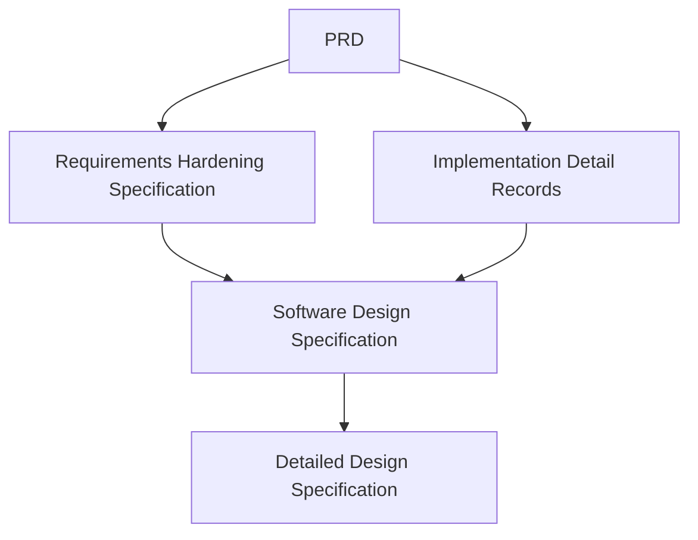

# SDS-009: Architecture Summary

> **Software Design Specification (SDS)**
>
> **Reference:** PRD, RHS, IDR
>
> **Status:** ✅ Approved
>
> **Priority:** 🟡 Informational

---

# 📖 Overview

Dokumen ini merupakan ringkasan keseluruhan (*Architecture Summary*) dari Software Design Specification Platform Digital Informatika Angkatan 2025.

Architecture Summary berfungsi sebagai dokumen penutup SDS yang merangkum seluruh keputusan arsitektur, prinsip desain, struktur sistem, serta hubungan antar dokumen desain yang telah ditetapkan.

Dokumen ini tidak memperkenalkan requirement maupun keputusan arsitektur baru. Seluruh informasi pada dokumen ini merupakan konsolidasi dari dokumen SDS sebelumnya.

---

# 🎯 Objectives

Architecture Summary bertujuan untuk:

- Memberikan gambaran menyeluruh mengenai arsitektur sistem.
- Menjadi referensi cepat bagi anggota tim baru.
- Merangkum seluruh keputusan desain utama.
- Menjadi baseline sebelum memasuki tahap Detailed Design Specification (DDS).
- Menjadi referensi evaluasi perubahan arsitektur di masa mendatang.

---

# 📦 SDS Document Structure

| SDS | Document |
|------|----------|
| SDS-001 | System Overview |
| SDS-002 | Architecture Principles |
| SDS-003 | Technology Stack |
| SDS-004 | High-Level Architecture |
| SDS-005 | Domain & Module Design |
| SDS-006 | Architecture Constraints |
| SDS-007 | External Dependencies |
| SDS-008 | Architecture Decisions |
| SDS-009 | Architecture Summary |

---

# 🏛️ Architecture Overview

Platform Digital Informatika Angkatan 2025 dikembangkan menggunakan pendekatan **Modular Monolith** dengan pemisahan domain bisnis berdasarkan tanggung jawab masing-masing.

Arsitektur dirancang untuk:

- Maintainable
- Modular
- Secure
- Scalable
- Reliable
- Extensible

Pendekatan ini dipilih agar sesuai dengan ruang lingkup MVP sekaligus memberikan fondasi yang kuat untuk pengembangan jangka panjang.

---

# 🧱 Architecture Layers

Sistem terdiri atas empat lapisan utama.

```text
Presentation Layer
        │
        ▼
Application Layer
        │
        ▼
Domain Layer
        │
        ▼
Data Layer
```

Setiap lapisan memiliki tanggung jawab yang jelas sesuai dengan prinsip *Separation of Concerns*.

---

# 🧩 Business Domains

Domain utama pada sistem meliputi:

- Identity & Access
- Dashboard
- Official Information
- Schedule
- Knowledge Hub
- Event
- Gallery
- Notification
- Audit
- Analytics
- Governance

Masing-masing domain dikembangkan secara modular dengan batas tanggung jawab yang jelas.

---

# 🛠️ Technology Baseline

Teknologi utama yang digunakan:

| Area | Technology |
|------|------------|
| Frontend | Nuxt.js |
| Backend | Go (Golang) |
| Database | PostgreSQL |
| Styling | Tailwind CSS |
| Version Control | Git & GitHub |
| Containerization | Docker |

Detail implementasi dijelaskan pada:

- SDS-003
- IDR-002

---

# 🔐 Security Baseline

Arsitektur mengikuti prinsip:

- Security by Design
- Least Privilege
- Secure Communication
- Authentication & Authorization
- Auditability

Detail keamanan dijelaskan pada:

- RHS-001
- RHS-008
- RHS-009
- IDR-015

---

# 📐 Architecture Principles

Seluruh desain sistem mengikuti prinsip berikut.

- Separation of Concerns
- Single Responsibility
- High Cohesion
- Low Coupling
- Reusability
- Maintainability
- Extensibility
- Consistency

---

# 🌐 External Dependencies

Platform bergantung pada layanan eksternal berikut.

- Hosting Infrastructure
- Domain & DNS
- Object Storage
- Source Code Repository
- Communication Services
- Analytics Service

Seluruh integrasi mengikuti prinsip *Loose Coupling* dan *Failure Isolation*.

---

# 🚧 Architecture Constraints

Implementasi sistem harus mematuhi batasan berikut.

- Modular Architecture
- Layer Separation
- Single Source of Truth
- HTTPS Communication
- Secure Password Storage
- Configuration Management
- Environment Separation
- Audit Logging

---

# 🔄 Architecture Traceability



---

# 📊 Document Relationships

| Document | Purpose |
|-----------|---------|
| PRD | Mendefinisikan kebutuhan bisnis. |
| RHS | Memperjelas requirement dan business rules. |
| IDR | Menentukan standar implementasi. |
| SDS | Mendefinisikan desain sistem tingkat tinggi. |
| DDS | Mendefinisikan desain teknis secara rinci. |

---

# 🚀 Next Phase

Setelah seluruh dokumen SDS disetujui, proses pengembangan memasuki tahap:

**Detailed Design Specification (DDS)**

Tahap DDS akan mendefinisikan implementasi teknis secara lebih rinci, meliputi:

- Component Design
- Database Design
- API Design
- Sequence Diagram
- Class Diagram
- Deployment Detail
- Interface Detail

---

# 📚 Related Documents

## Product Documentation

- Product Requirements Document (PRD)
- Requirements Hardening Specification (RHS)
- Implementation Detail Records (IDR)

## Current Documentation

- SDS-001 hingga SDS-008

## Next Documentation

- DDS (Detailed Design Specification)

---

# ✅ Review Checklist

- [ ] Seluruh dokumen SDS telah selesai.
- [ ] Seluruh referensi antar dokumen telah diverifikasi.
- [ ] Architecture Summary sesuai dengan seluruh dokumen SDS.
- [ ] Tidak terdapat keputusan arsitektur yang bertentangan.
- [ ] Dokumentasi siap digunakan sebagai baseline DDS.

---

# 🔄 Traceability Matrix

| Summary Section | Related Document |
|-----------------|------------------|
| Architecture Overview | SDS-001 |
| Architecture Principles | SDS-002 |
| Technology Baseline | SDS-003 |
| High-Level Architecture | SDS-004 |
| Domain Design | SDS-005 |
| Architecture Constraints | SDS-006 |
| External Dependencies | SDS-007 |
| Architecture Decisions | SDS-008 |

---

# 🔗 References

## Product Documentation

- [Product Requirements Document (PRD)](../PRD.md)
- [Requirements Hardening Specification (RHS)](../rhs/README.md)
- [Implementation Detail Records (IDR)](../IDR/README.md)

## Related SDS

- [SDS README](./README.md)
- [SDS-008: Architecture Decisions](./08-sds-008-architecture-decisions.md)

---

# 📝 Revision History

| Version | Date | Description |
|----------|------|-------------|
| 1.0 | 2026-08-05 | Initial Architecture Summary documentation |
