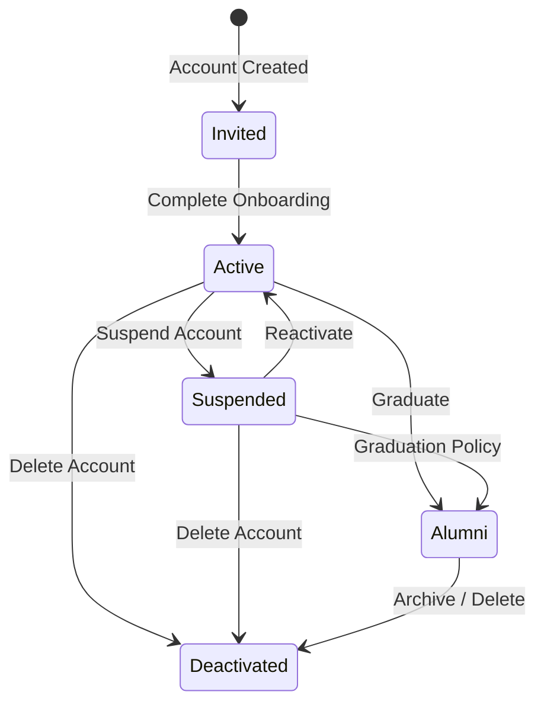

# 🛡️ RHS-001: Authentication and Onboarding

> **Requirement Hardening Specification**
>
> **Reference:** PRD §8.1 – Authentication & Account  
> **Status:** Approved  
> **Priority:** Critical (Launch Blocking)

---

# 📖 Overview

Dokumen ini mendefinisikan requirement teknis dan aturan bisnis untuk proses **Authentication** dan **Onboarding** mahasiswa pada Platform Digital Angkatan Informatika 2025.

Tujuan utama requirement ini adalah memastikan bahwa setiap akun:

- Dibuat secara aman.
- Memiliki proses onboarding yang konsisten.
- Dapat diaudit.
- Memiliki kontrol akses yang benar.
- Memenuhi standar keamanan minimum.

---

# 🎯 Objective

- Memastikan proses aktivasi akun berjalan aman.
- Memastikan onboarding wajib diselesaikan sebelum menggunakan sistem.
- Mencegah penggunaan password yang lemah.
- Menjamin seluruh proses dapat diaudit.

---

# 📋 Business Rules

| ID | Rule |
|----|------|
| AUTH-01 | Akun mahasiswa dibuat oleh **Superadmin** menggunakan **NIM** sebagai username. |
| AUTH-02 | Password awal berupa temporary credential yang dihasilkan secara acak dan aman. |
| AUTH-03 | Password sementara tidak boleh menggunakan NIM atau informasi pribadi. |
| AUTH-04 | Login pertama wajib melakukan perubahan password. |
| AUTH-05 | Onboarding dianggap selesai apabila password berhasil diganti, profil wajib dilengkapi, dan dashboard berhasil diakses. |
| AUTH-06 | Mahasiswa yang belum menyelesaikan onboarding tidak boleh mengakses fitur internal selain proses onboarding. |
| AUTH-07 | Password reset hanya dapat dilakukan oleh Superadmin pada MVP. |

---

# ✅ Validation Rules

| ID | Rule |
|----|------|
| VAL-01 | NIM wajib unik. |
| VAL-02 | Password baru minimal **12 karakter**. |
| VAL-03 | Password baru tidak boleh sama dengan temporary password. |
| VAL-04 | Password tidak boleh menggunakan NIM, nama, atau tanggal lahir. |
| VAL-05 | Password harus memenuhi kebijakan password yang berlaku. |
| VAL-06 | Profil wajib terdiri dari Nama, NIM, Angkatan, dan Asal Daerah. |

---

# 🔐 Permission Rules

| Role | Permission |
|------|------------|
| Student | Menyelesaikan onboarding akun sendiri |
| Administrator | Tidak dapat melihat password, password hash, TOTP secret, maupun backup code |
| Superadmin | Membuat akun, reset password, mengubah status akun |

---

# 🔄 State Transition



---

# 📊 State Transition Summary

| State | Allowed Transition |
|------|--------------------|
| **Invited** | → Active |
| **Active** | → Suspended, Alumni, Deactivated |
| **Suspended** | → Active, Alumni, Deactivated |
| **Alumni** | → Deactivated |

---

# ⚠️ Edge Cases & Error Handling

| Scenario | Expected Behavior |
|----------|-------------------|
| Login menggunakan temporary password setelah password berhasil diganti | Ditolak |
| Password change gagal | Akun tetap berada pada status onboarding sebelumnya |
| NIM sudah digunakan | Pembuatan akun dibatalkan |
| Request onboarding dikirim ulang | Sistem harus idempotent |
| Temporary password kedaluwarsa | Superadmin melakukan reset password |
| Browser ditutup saat onboarding | Progress tetap tersimpan sesuai kebijakan sistem |

---

# ✅ Acceptance Criteria

| ID | Given | When | Then |
|----|-------|------|------|
| AC-01 | Akun baru | Mahasiswa login pertama kali | Sistem memaksa perubahan password |
| AC-02 | Password baru valid | Password disimpan | Temporary password tidak dapat digunakan kembali |
| AC-03 | Profil wajib belum lengkap | Mahasiswa membuka dashboard | Sistem mengarahkan ke onboarding |
| AC-04 | Onboarding selesai | Mahasiswa login kembali | Dashboard dapat diakses |
| AC-05 | Password tidak memenuhi kebijakan | Mahasiswa menyimpan password | Sistem menolak dan menampilkan validasi |

---

# 🔒 Security Requirements

| Requirement | Implementation |
|------------|----------------|
| Password Storage | Argon2id atau BCrypt |
| Password Transmission | HTTPS Only |
| Password Hash | Tidak pernah dikirim kembali ke client |
| Credential Logging | Dilarang muncul pada log |
| Session | HttpOnly Cookie atau Secure Token |
| Rate Limiting | Wajib pada endpoint login |
| Brute Force Protection | Account Lockout / Delay |
| CSRF Protection | Wajib untuk session-based authentication |

---

# 📝 Audit Requirements

Sistem harus mencatat minimal aktivitas berikut:

- Account Created
- First Login
- Password Changed
- Password Reset
- Account Activated
- Account Suspended
- Account Reactivated
- Account Deactivated

Audit log minimal berisi:

- Timestamp
- User ID
- Actor
- Action
- IP Address (opsional sesuai kebijakan)
- Device Information (opsional)

---

# 🌐 API Contract Reference

## Login

```http
POST /api/v1/auth/login
```

```json
{
  "nim": "2025001",
  "password": "temporary_password"
}
```

---

## Complete Onboarding

```http
POST /api/v1/auth/onboarding
```

```json
{
  "new_password": "SecurePassword123!",
  "profile": {
    "name": "John Doe",
    "origin": "Jakarta"
  }
}
```

---

## Reset Password (Superadmin)

```http
POST /api/v1/auth/reset-password
```

```json
{
  "user_id": "uuid",
  "reason": "User requested reset"
}
```

---

# 📚 Related Documents

- PRD §8.1 Authentication & Account
- RHS-009 — Authorization & RBAC
- RHS-010 — Security & Password Policy
- RHS-011 — Audit Log
- API Specification (Authentication)
- Database Schema (Users)

---

# 📌 Notes

- Authentication merupakan **Launch Blocking Feature**.
- Onboarding wajib selesai sebelum mahasiswa memperoleh akses ke fitur internal.
- Seluruh implementasi harus mengikuti kebijakan keamanan platform dan prinsip **least privilege**.
