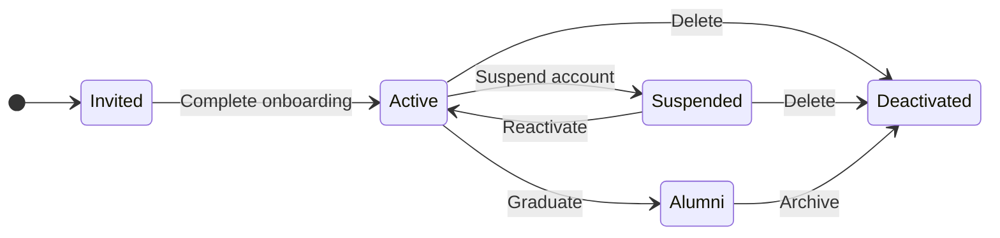

# 🛡️ RHS-001: Authentication and Onboarding

**Tujuan:** Memastikan akun mahasiswa dapat diaktifkan dengan aman dan onboarding memiliki hasil yang terukur.

---

## 📋 Business Rules

| ID | Rule |
|----|------|
| AUTH-01 | Akun mahasiswa dibuat oleh Superadmin menggunakan NIM sebagai username/identifier |
| AUTH-02 | Password awal berupa temporary credential acak yang aman dan tidak menggunakan NIM atau data pribadi |
| AUTH-03 | Pada login pertama, mahasiswa wajib mengganti password |
| AUTH-04 | Mahasiswa belum dianggap selesai onboarding sampai password diganti, profil wajib dilengkapi, dan dashboard berhasil diakses |
| AUTH-05 | Akun yang belum selesai onboarding tidak boleh mengakses fitur internal normal selain flow onboarding yang diperlukan |

---

## ✅ Validation Rules

| ID | Rule |
|----|------|
| VAL-01 | NIM wajib unik |
| VAL-02 | Password baru minimum 12 karakter |
| VAL-03 | Password baru tidak boleh sama dengan temporary password |
| VAL-04 | Password tidak boleh menggunakan nilai yang mudah ditebak (NIM, nama, tanggal lahir) |
| VAL-05 | Data wajib profil: nama, NIM, angkatan, asal daerah |

---

## 🔐 Permission Rules

| ID | Rule |
|----|------|
| PER-01 | Mahasiswa hanya dapat menyelesaikan onboarding untuk akun sendiri |
| PER-02 | Superadmin dapat membuat dan mengelola akun |
| PER-03 | Administrator tidak dapat melihat password, password hash, TOTP secret, atau backup codes |

---

## 🔄 State Transition

