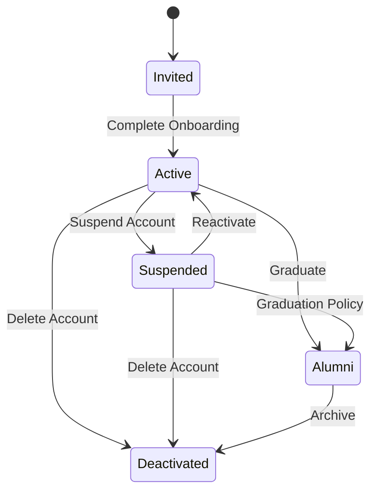

# 🛡️ RHS-001: Authentication & Onboarding

> **Requirement Hardening Specification**
>
> **Reference:** PRD §8.1 – Authentication & Account  
> **Document ID:** RHS-001  
> **Status:** ✅ Approved  
> **Priority:** 🔴 Critical (Launch Blocking)

---

# 📖 Overview

Dokumen ini mendefinisikan aturan implementasi (*implementation requirements*) untuk proses **Authentication & Onboarding** pada Platform Digital Angkatan Informatika 2025.

Requirement pada dokumen ini merupakan turunan langsung dari **PRD Section 8.1** dan menjadi acuan implementasi bagi Engineering, QA, maupun Architecture.

---

# 🎯 Objective

Requirement ini bertujuan untuk memastikan bahwa:

- proses autentikasi berlangsung secara aman;
- onboarding mahasiswa berjalan konsisten;
- seluruh aktivitas autentikasi dapat diaudit;
- akun yang belum menyelesaikan onboarding tidak memperoleh akses ke area internal.

---

# 📋 Business Rules

| ID | Rule |
|----|------|
| AUTH-01 | Akun mahasiswa dibuat oleh **Superadmin** menggunakan **NIM** sebagai username. |
| AUTH-02 | Password awal berupa temporary credential yang dihasilkan secara acak dan aman. |
| AUTH-03 | Password awal tidak boleh menggunakan NIM maupun data pribadi pengguna. |
| AUTH-04 | Login pertama wajib mengarahkan pengguna ke proses penggantian password. |
| AUTH-05 | Onboarding dianggap selesai apabila password berhasil diganti, profil wajib telah dilengkapi, dan dashboard berhasil diakses. |
| AUTH-06 | Akun yang belum menyelesaikan onboarding tidak boleh mengakses fitur internal selain proses onboarding. |
| AUTH-07 | Password reset pada MVP hanya dilakukan oleh Superadmin setelah proses verifikasi identitas pengguna. |

---

# ✅ Validation Rules

| ID | Requirement |
|----|-------------|
| VAL-01 | NIM wajib unik. |
| VAL-02 | Password baru minimal **12 karakter**. |
| VAL-03 | Password baru tidak boleh sama dengan temporary password. |
| VAL-04 | Password tidak boleh menggunakan NIM, nama, ataupun tanggal lahir. |
| VAL-05 | Profil wajib minimal terdiri dari **Nama, NIM, Angkatan, dan Asal Daerah**. |

---

# 🔐 Permission Rules

| Role | Permission |
|------|------------|
| Student | Menyelesaikan onboarding akun sendiri. |
| Administrator | Tidak dapat melihat password, password hash, TOTP secret, maupun backup code. |
| Superadmin | Membuat akun, melakukan reset password, mengubah status akun, dan mengelola onboarding. |

---

# 🔄 Account State Transition

---

# 📊 State Transition Summary

| Current State | Allowed Transition |
|---------------|-------------------|
| **Invited** | → Active |
| **Active** | → Suspended, Alumni, Deactivated |
| **Suspended** | → Active, Alumni, Deactivated |
| **Alumni** | → Deactivated |

---

# ⚠️ Edge Cases & Error Handling

| Scenario | Expected Behaviour |
|----------|--------------------|
| Login menggunakan temporary password setelah password berhasil diganti | Sistem harus menolak autentikasi menggunakan temporary password. |
| Password change gagal | Status onboarding tidak berubah dan pengguna tetap berada pada flow onboarding. |
| NIM telah digunakan | Pembuatan akun dibatalkan dan sistem menampilkan pesan bahwa NIM sudah terdaftar. |
| Request onboarding dikirim ulang | Operasi harus bersifat **idempotent** dan tidak membuat akun maupun status ganda. |
| Temporary password telah kedaluwarsa | Superadmin harus melakukan reset password sebelum pengguna dapat login kembali. |

---

# ✅ Acceptance Criteria

| ID | Given | When | Then |
|----|-------|------|------|
| AC-01 | Akun baru telah dibuat | Pengguna login pertama kali | Sistem wajib memaksa penggantian password. |
| AC-02 | Password baru valid | Password berhasil disimpan | Temporary password tidak dapat digunakan kembali. |
| AC-03 | Profil wajib belum lengkap | Pengguna membuka dashboard | Sistem mengarahkan pengguna kembali ke proses onboarding. |
| AC-04 | Onboarding telah selesai | Pengguna login kembali | Dashboard dapat diakses secara normal. |

---

# 🔒 Security Requirements

| ID | Requirement |
|----|-------------|
| SEC-01 | Password wajib disimpan menggunakan algoritma hashing yang aman (Argon2id atau BCrypt). |
| SEC-02 | Password hash tidak boleh dikirim ke client. |
| SEC-03 | Credential tidak boleh muncul pada application log maupun audit log. |
| SEC-04 | Seluruh komunikasi autentikasi wajib menggunakan HTTPS/TLS. |
| SEC-05 | Endpoint autentikasi wajib memiliki rate limiting untuk mencegah brute-force attack. |

---

# 📝 Audit Requirements

Sistem wajib mencatat aktivitas berikut:

- Account Created
- First Login
- Password Changed
- Password Reset
- Account Activated
- Account Suspended
- Account Reactivated
- Account Deactivated

Setiap audit event minimal mencatat:

- Actor
- Timestamp
- Action
- Target User
- Result (Success / Failed)

---

# 📑 Requirement Traceability Matrix (RTM)

| PRD Reference | Requirement IDs |
|--------------|-----------------|
| PRD §7.3 – Onboarding | AUTH-04, AUTH-05, AUTH-06 |
| PRD §8.1 – Authentication & Account | AUTH-01 → AUTH-07 |
| PRD §10.1 – RBAC | PER-01 → PER-03 |
| PRD §10.2 – Administrative Security | SEC-01 → SEC-05 |
| PRD §12.1 – Audit Log | Audit Requirements |

---

# 🔗 Related Documents

| Document | Description |
|----------|-------------|
| PRD §8.1 | Authentication & Account |
| Role & Permission Baseline | Definisi role dasar |
| RHS-007 | Account Lifecycle |
| RHS-008 | Role Based Access Control |
| RHS-009 | Security, 2FA & Password Reset |
| RHS-012 | Audit Log |

---

# 📌 Notes

- Authentication merupakan **Launch Blocking Feature**.
- Onboarding wajib diselesaikan sebelum mahasiswa memperoleh akses ke fitur internal.
- Seluruh implementasi harus mengikuti prinsip:
  - **Security by Default**
  - **Least Privilege**
  - **Auditability**
  - **Privacy by Design**

---

> **End of Document — RHS-001: Authentication & Onboarding**
