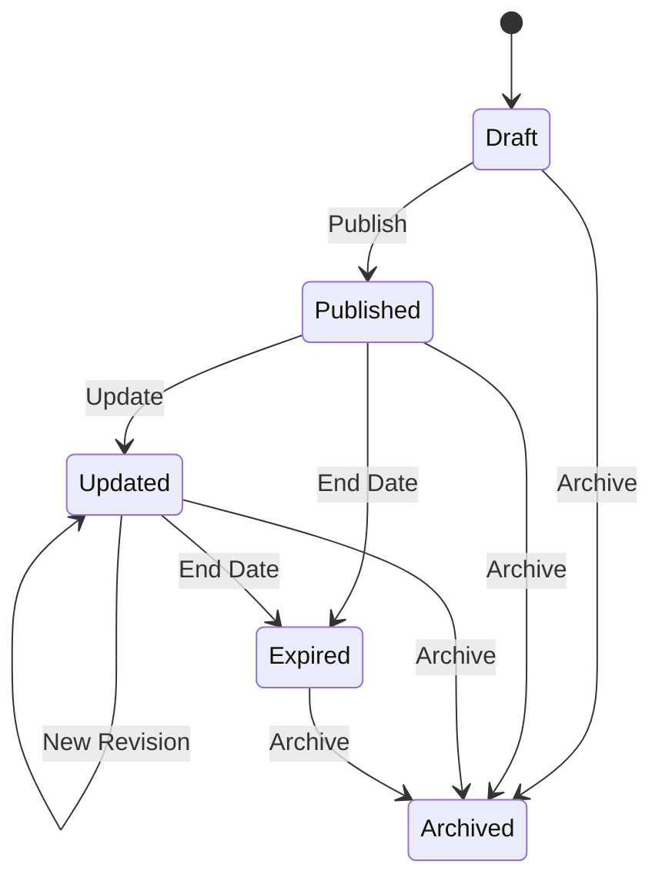

# 📢 RHS-002: Official Information

> **Requirement Hardening Specification**
>
> **Reference:** PRD §8.3 – Official Information / Announcement  
> **Document ID:** RHS-002  
> **Status:** ✅ Approved  
> **Priority:** 🔴 Critical (Launch Blocking)

---

# 📖 Overview

Dokumen ini mendefinisikan aturan implementasi (*implementation requirements*) untuk modul **Official Information**.

Modul ini merupakan fondasi utama Platform Digital Angkatan Informatika 2025 sebagai **Single Source of Truth**, sehingga seluruh informasi resmi yang dipublikasikan harus memenuhi proses verifikasi, memiliki lifecycle yang jelas, serta dapat diaudit.

---

# 🎯 Objective

Requirement ini bertujuan untuk memastikan bahwa:

- seluruh informasi resmi berasal dari sumber yang dapat dipercaya;
- informasi yang dipublikasikan selalu merupakan versi terbaru;
- perubahan informasi dapat ditelusuri melalui audit log;
- pengguna hanya menerima informasi yang telah diverifikasi.

---

# 📋 Business Rules

| ID | Rule |
|----|------|
| OFF-01 | Hanya informasi yang telah diverifikasi yang dapat dipublikasikan sebagai Official Information. |
| OFF-02 | Informasi akademik harus berasal dari dosen atau sumber resmi kampus sebelum dipublikasikan. |
| OFF-03 | Informasi kegiatan angkatan harus diverifikasi melalui pengurus atau pihak yang berwenang. |
| OFF-04 | Informasi yang belum diverifikasi tidak boleh dipublikasikan sebagai Official Information. |
| OFF-05 | Dalam kondisi mendesak, pemberitahuan sementara dapat disampaikan melalui kanal komunikasi lain dengan status **Belum Terverifikasi**. |
| OFF-06 | Informasi yang telah dipublikasikan dapat diperbarui tanpa mengubah identitas informasi. |
| OFF-07 | Versi terbaru selalu menjadi versi utama yang ditampilkan kepada pengguna. |
| OFF-08 | Riwayat perubahan wajib disimpan pada audit log. |
| OFF-09 | Informasi permanen tidak memiliki tanggal berakhir. |
| OFF-10 | Informasi sementara wajib memiliki periode publikasi yang jelas. |

---

# ✅ Validation Rules

| ID | Requirement |
|----|-------------|
| VAL-01 | Judul wajib diisi. |
| VAL-02 | Isi informasi wajib tersedia. |
| VAL-03 | Prioritas hanya boleh menggunakan nilai **Critical**, **Important**, atau **Normal**. |
| VAL-04 | Lifecycle harus menggunakan status yang telah ditentukan sistem. |
| VAL-05 | Start Date tidak boleh lebih besar daripada End Date. |
| VAL-06 | Informasi yang telah melewati End Date tidak boleh tampil sebagai informasi aktif. |
| VAL-07 | Setiap informasi harus memiliki Publisher. |
| VAL-08 | Informasi yang telah diverifikasi wajib memiliki Verification Source. |

---

# 🔐 Permission Rules

| Role | Permission |
|------|------------|
| Guest | Melihat informasi publik yang telah dipublikasikan. |
| Student | Melihat seluruh Official Information yang menjadi hak aksesnya. |
| Administrator | Membuat, mengubah, serta mengarsipkan informasi sesuai kewenangan operasional. |
| Superadmin | Memiliki kontrol penuh terhadap seluruh lifecycle Official Information. |

---

# 🔄 Information Lifecycle

---

# 📊 Lifecycle Summary

| State | Description |
|-------|-------------|
| Draft | Informasi masih dalam proses penyusunan dan belum dapat diakses pengguna. |
| Published | Informasi aktif dan dapat diakses sesuai hak akses. |
| Updated | Informasi telah direvisi, namun versi terbaru tetap menjadi informasi utama. |
| Expired | Informasi telah melewati masa berlaku dan tidak lagi dianggap aktif. |
| Archived | Informasi disimpan sebagai arsip dan tidak ditampilkan pada daftar informasi aktif. |

---

# ⚠️ Edge Cases & Error Handling

| Scenario | Expected Behaviour |
|----------|--------------------|
| Informasi diperbarui beberapa kali | Pengguna hanya melihat versi terbaru. |
| Informasi penting diperbarui setelah telah dibaca | Dashboard tetap menampilkan versi terbaru sebagai informasi utama. |
| End Date sama dengan waktu saat ini | Sistem menggunakan aturan boundary yang konsisten untuk menentukan status aktif atau berakhir. |
| Informasi dipublikasikan tanpa verifikasi | Sistem menolak proses publikasi. |
| Publisher menghapus informasi yang masih aktif | Informasi harus melalui proses archive sesuai lifecycle. |

---

# ✅ Acceptance Criteria

| ID | Given | When | Then |
|----|-------|------|------|
| AC-01 | Informasi belum diverifikasi | Admin melakukan publish | Sistem menolak publikasi. |
| AC-02 | Informasi berstatus Published | Dashboard dibuka | Informasi tampil sesuai prioritas dan visibility. |
| AC-03 | Informasi diperbarui | Perubahan disimpan | Audit log mencatat perubahan. |
| AC-04 | End Date telah terlewati | Scheduler dijalankan | Status berubah menjadi Expired. |
| AC-05 | Informasi berprioritas Critical | Dashboard dimuat | Informasi tampil sebelum informasi lain. |

---

# 🔒 Security Requirements

| ID | Requirement |
|----|-------------|
| SEC-01 | Hanya pengguna yang memiliki permission dapat membuat atau mengubah Official Information. |
| SEC-02 | Seluruh perubahan harus melewati validasi authorization pada backend. |
| SEC-03 | Informasi yang belum dipublikasikan tidak boleh dapat diakses oleh pengguna biasa. |
| SEC-04 | Metadata publisher dan verification source tidak boleh dapat dimanipulasi secara langsung oleh client. |

---

# 📝 Audit Requirements

Sistem wajib mencatat aktivitas berikut:

- Information Created
- Information Published
- Information Updated
- Information Archived
- Information Expired
- Priority Changed
- Verification Completed

Setiap audit event minimal mencatat:

- Actor
- Timestamp
- Action
- Information ID
- Previous State
- Current State

---

# 🔗 Related Documents

| Document | Description |
|----------|-------------|
| PRD §8.3 | Official Information |
| RHS-003 | Dashboard Prioritization |
| RHS-008 | Role Based Access Control |
| RHS-012 | Audit Log |

---

# 📌 Notes

- Official Information merupakan **fondasi utama** Platform Digital Angkatan Informatika 2025 sebagai **Single Source of Truth**.
- Dashboard harus selalu menampilkan **versi terbaru** dari setiap informasi resmi.
- Riwayat perubahan disimpan untuk kepentingan audit dan tidak ditampilkan sebagai informasi utama kepada pengguna.
- Seluruh implementasi harus mengikuti prinsip:
  - **Integrity**
  - **Consistency**
  - **Auditability**
  - **Trustworthiness**

---

> **End of Document — RHS-002: Official Information**
