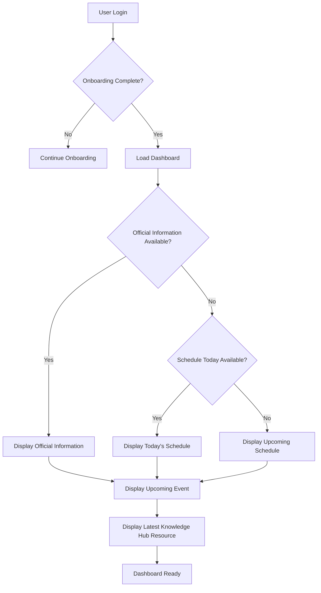

# 🏠 RHS-003: Dashboard Prioritization

> **Requirement Hardening Specification**
>
> **Reference:** PRD §8.2 – Dashboard  
> **Document ID:** RHS-003  
> **Status:** ✅ Approved  
> **Priority:** 🔴 Critical (Launch Blocking)

---

# 📖 Overview

Dokumen ini mendefinisikan aturan implementasi (*implementation requirements*) untuk modul **Dashboard** sebagai halaman utama setelah pengguna berhasil melakukan autentikasi.

Dashboard merupakan pusat informasi yang bertujuan menjawab pertanyaan utama pengguna:

> **"Apa yang penting bagi saya saat ini?"**

Seluruh informasi yang ditampilkan harus berasal dari sumber data resmi dan mengikuti aturan prioritas yang telah ditentukan.

---

# 🎯 Objective

Requirement ini bertujuan untuk memastikan bahwa:

- dashboard selalu menampilkan informasi yang paling relevan;
- pengguna memperoleh informasi penting tanpa harus mencari secara manual;
- informasi yang ditampilkan selalu berasal dari sumber resmi;
- dashboard tetap informatif meskipun tidak terdapat pengumuman baru.

---

# 📋 Business Rules

| ID | Rule |
|----|------|
| DASH-01 | Dashboard hanya dapat diakses oleh pengguna yang telah menyelesaikan proses onboarding. |
| DASH-02 | Dashboard harus menjadi halaman pertama setelah proses login berhasil. |
| DASH-03 | Dashboard harus menampilkan informasi berdasarkan tingkat prioritas. |
| DASH-04 | Official Information yang masih aktif memiliki prioritas tertinggi. |
| DASH-05 | Jika tidak terdapat Official Information aktif, dashboard harus menampilkan jadwal kuliah hari ini sebagai fokus utama. |
| DASH-06 | Jika tidak terdapat jadwal hari ini, dashboard harus menampilkan jadwal terdekat. |
| DASH-07 | Dashboard dapat menampilkan event mendatang apabila tersedia. |
| DASH-08 | Dashboard dapat menampilkan resource terbaru dari Knowledge Hub. |
| DASH-09 | Dashboard hanya boleh menampilkan informasi yang dapat diakses sesuai role pengguna. |
| DASH-10 | Informasi yang telah kedaluwarsa tidak boleh ditampilkan sebagai informasi aktif. |

---

# ✅ Validation Rules

| ID | Requirement |
|----|-------------|
| VAL-01 | Dashboard hanya dapat diakses oleh akun berstatus **Active**. |
| VAL-02 | Informasi Official harus berstatus **Published**. |
| VAL-03 | Jadwal yang ditampilkan harus mempertimbangkan perubahan melalui Exception Schedule. |
| VAL-04 | Resource yang tampil harus berstatus **Approved**. |
| VAL-05 | Event yang tampil harus berstatus **Published**. |
| VAL-06 | Informasi yang telah melewati masa berlaku tidak boleh muncul pada dashboard. |

---

# 🔐 Permission Rules

| Role | Permission |
|------|------------|
| Guest | Tidak memiliki akses ke dashboard internal. |
| Student | Melihat dashboard sesuai hak akses. |
| Administrator | Melihat dashboard operasional. |
| Superadmin | Melihat seluruh informasi operasional dan administratif. |

---

# 🔄 Dashboard Prioritization Flow

---

# 📊 Information Priority

| Priority | Component |
|----------|-----------|
| 1 | Official Information |
| 2 | Today's Schedule |
| 3 | Upcoming Schedule |
| 4 | Upcoming Event |
| 5 | Latest Knowledge Hub Resource |
| 6 | Recent Activity |

---

# ⚠️ Edge Cases & Error Handling

| Scenario | Expected Behaviour |
|----------|--------------------|
| Tidak ada pengumuman | Dashboard langsung menampilkan jadwal hari ini. |
| Tidak ada jadwal hari ini | Dashboard menampilkan jadwal berikutnya. |
| Tidak ada event | Komponen event tidak ditampilkan. |
| Tidak ada resource terbaru | Komponen resource disembunyikan tanpa memengaruhi komponen lain. |
| Semua data kosong | Dashboard tetap menampilkan pesan informatif dan tidak menghasilkan error. |
| Official Information berstatus Expired | Tidak boleh ditampilkan. |

---

# ✅ Acceptance Criteria

| ID | Given | When | Then |
|----|-------|------|------|
| AC-01 | Onboarding selesai | User login | Dashboard berhasil dimuat. |
| AC-02 | Official Information tersedia | Dashboard dibuka | Informasi resmi tampil pada prioritas pertama. |
| AC-03 | Tidak ada Official Information | Dashboard dimuat | Jadwal hari ini menjadi fokus utama. |
| AC-04 | Jadwal berubah melalui Exception | Dashboard dimuat | Jadwal terbaru ditampilkan. |
| AC-05 | Resource terbaru tersedia | Dashboard dimuat | Resource muncul pada bagian Knowledge Hub. |

---

# 🔒 Security Requirements

| ID | Requirement |
|----|-------------|
| SEC-01 | Dashboard hanya dapat diakses oleh pengguna yang telah terautentikasi. |
| SEC-02 | Informasi ditampilkan sesuai authorization pengguna. |
| SEC-03 | Data dashboard tidak boleh mengungkap informasi yang tidak menjadi hak akses pengguna. |
| SEC-04 | Seluruh request dashboard harus divalidasi oleh backend. |

---

# 📝 Audit Requirements

Sistem minimal mencatat aktivitas berikut:

- Dashboard Viewed
- Official Information Opened
- Schedule Viewed
- Knowledge Hub Resource Opened

Setiap audit event minimal mencatat:

- User ID
- Timestamp
- Action
- Resource
- Result

---

# 📑 Requirement Traceability Matrix (RTM)

| PRD Reference | Requirement IDs |
|--------------|-----------------|
| PRD §8.2 – Dashboard | DASH-01 → DASH-10 |
| PRD §8.3 – Official Information | Dashboard Priority |
| PRD §8.4 – Schedule | Schedule Component |
| PRD §8.5 – Knowledge Hub | Resource Component |
| PRD §12.1 – Audit Log | Dashboard Audit |

---

# 🔗 Related Documents

| Document | Description |
|----------|-------------|
| PRD §8.2 | Dashboard |
| RHS-002 | Official Information |
| RHS-004 | Schedule & Exception Model |
| RHS-005 | Knowledge Hub |
| RHS-012 | Audit Log |

---

# 📌 Notes

- Dashboard merupakan **entry point utama** setelah proses login.
- Dashboard harus mengutamakan **relevansi**, bukan jumlah informasi.
- Komponen dashboard harus dapat berkembang tanpa mengubah prinsip prioritas utama.
- Seluruh informasi yang ditampilkan harus berasal dari modul resmi dan mengikuti hak akses pengguna.

---

> **End of Document — RHS-003: Dashboard Prioritization**
