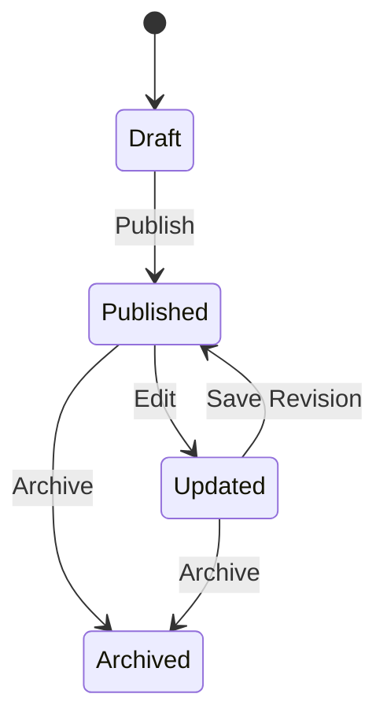
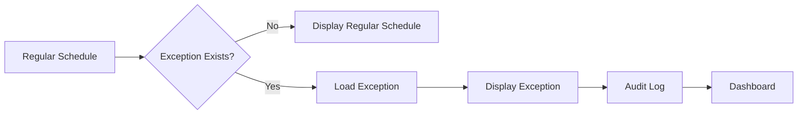

# 📅 RHS-004: Schedule & Exception Management

> **Requirement Hardening Specification**
>
> **Reference:** PRD §8.4 – Schedule
>
> **Status:** ✅ Approved
>
> **Priority:** 🔴 Critical (Launch Blocking)

---

# 📖 Overview

Dokumen ini mendefinisikan aturan implementasi untuk modul **Schedule Management** pada Platform Digital Informatika Angkatan 2025.

Fokus utama requirement ini adalah memastikan jadwal akademik menjadi **Single Source of Truth** yang selalu konsisten, mudah dipelihara, dapat diaudit, dan mampu menangani perubahan jadwal tanpa mengubah data jadwal reguler secara langsung.

Perubahan jadwal dilakukan menggunakan **Exception Model**, sehingga histori jadwal tetap terjaga dan setiap perubahan memiliki jejak audit yang jelas.

---

# 🎯 Objective

- Menyediakan jadwal kuliah reguler yang konsisten.
- Mendukung perubahan jadwal melalui Exception Model.
- Menjamin dashboard selalu menampilkan jadwal yang paling valid.
- Menyediakan histori perubahan jadwal.
- Memastikan perubahan jadwal dapat diaudit.
- Menghindari inkonsistensi data akibat perubahan langsung pada jadwal reguler.

---

# 📌 Scope

Requirement ini mencakup:

- Regular Schedule
- Schedule Exception
- Dashboard Schedule
- Schedule Visibility
- Schedule Audit
- Schedule Lifecycle

Requirement ini **tidak mencakup**:

- Exam Schedule
- Assignment Deadline
- Attendance
- Academic Calendar Management

Karena seluruh fitur tersebut berada di luar ruang lingkup MVP.

---

# 📋 Business Rules

| ID | Rule |
|----|------|
| SCH-01 | Sistem harus memiliki satu jadwal reguler sebagai baseline. |
| SCH-02 | Jadwal reguler tidak boleh diubah untuk menangani perubahan sementara. |
| SCH-03 | Perubahan jadwal dilakukan menggunakan Exception Model. |
| SCH-04 | Exception hanya berlaku pada tanggal atau periode yang ditentukan. |
| SCH-05 | Setelah exception berakhir, sistem otomatis kembali menggunakan jadwal reguler. |
| SCH-06 | Dashboard selalu menampilkan jadwal hasil evaluasi antara Regular Schedule dan Exception. |
| SCH-07 | Satu jadwal hanya boleh memiliki satu exception aktif pada waktu yang sama. |
| SCH-08 | Seluruh perubahan jadwal wajib tercatat pada audit log. |
| SCH-09 | Perubahan jadwal tidak boleh menghapus histori jadwal sebelumnya. |
| SCH-10 | Jadwal yang telah dipublikasikan hanya dapat diubah oleh role yang berwenang. |

---

# ✅ Validation Rules

| ID | Rule |
|----|------|
| VAL-01 | Mata kuliah wajib dipilih. |
| VAL-02 | Hari wajib valid. |
| VAL-03 | Jam mulai harus lebih kecil dari jam selesai. |
| VAL-04 | Ruangan wajib diisi apabila perkuliahan dilakukan secara tatap muka. |
| VAL-05 | Exception wajib memiliki tanggal berlaku. |
| VAL-06 | Exception tidak boleh memiliki periode yang saling bertabrakan. |
| VAL-07 | Schedule tidak boleh memiliki waktu negatif atau kosong. |

---

# 🔐 Permission Rules

| Role | Permission |
|------|------------|
| Guest | Tidak memiliki akses. |
| Student | Melihat jadwal. |
| Administrator | Membuat dan mengubah jadwal serta exception sesuai kewenangan. |
| Superadmin | Kontrol penuh terhadap seluruh jadwal. |

---

# 🔄 Schedule Lifecycle



---

# 🔄 Schedule Exception Workflow



---

# ⚖ Schedule Resolution Priority

Apabila lebih dari satu sumber informasi tersedia, sistem harus menentukan jadwal yang ditampilkan berdasarkan prioritas berikut.

| Priority | Source |
|----------|--------|
| 1 | Active Schedule Exception |
| 2 | Regular Schedule |
| 3 | Archived Schedule |

Dashboard hanya boleh menampilkan hasil evaluasi prioritas tersebut.

---

# 🚨 Conflict Detection Rules

Sistem harus melakukan validasi sebelum exception dipublikasikan.

| ID | Rule |
|----|------|
| CON-01 | Tidak boleh terdapat dua exception aktif pada jadwal yang sama dan periode yang sama. |
| CON-02 | Exception tidak boleh memiliki waktu selesai lebih awal daripada waktu mulai. |
| CON-03 | Exception yang dibatalkan tidak boleh ditampilkan pada dashboard. |
| CON-04 | Exception yang telah melewati masa berlaku tidak boleh digunakan kembali. |
| CON-05 | Seluruh konflik harus menghasilkan pesan validasi yang jelas. |

---

# ⚠ Edge Cases & Error Handling

| Scenario | Expected Behavior |
|----------|-------------------|
| Jadwal dibatalkan | Dashboard menampilkan status "Class Cancelled". |
| Kuliah pengganti | Dashboard menampilkan jadwal pengganti sesuai exception. |
| Ruangan berubah | Dashboard menggunakan ruangan terbaru. |
| Jam berubah | Dashboard menggunakan jam terbaru. |
| Exception berakhir | Dashboard otomatis kembali ke jadwal reguler. |
| Exception dihapus | Sistem kembali menggunakan jadwal reguler. |

---

# ✅ Acceptance Criteria

| ID | Given | When | Then |
|----|-------|------|------|
| AC-01 | Jadwal reguler tersedia | Dashboard dibuka | Jadwal reguler tampil. |
| AC-02 | Exception aktif tersedia | Dashboard dibuka | Exception menggantikan jadwal reguler. |
| AC-03 | Exception berakhir | Dashboard dimuat kembali | Jadwal reguler tampil kembali. |
| AC-04 | Exception dibatalkan | Dashboard dimuat | Exception tidak ditampilkan. |
| AC-05 | Jadwal diperbarui | Audit diperiksa | Riwayat perubahan tersedia. |

---

# 🔒 Security Considerations

- Hanya role yang memiliki permission yang dapat mengubah jadwal.
- Seluruh endpoint schedule wajib menggunakan autentikasi.
- Perubahan jadwal harus melalui validasi backend.
- Schedule ID tidak boleh dapat ditebak.
- Semua perubahan wajib menghasilkan audit event.

---

# 📝 Audit Requirements

Sistem wajib mencatat aktivitas berikut.

| Event |
|-------|
| Schedule Created |
| Schedule Updated |
| Schedule Published |
| Schedule Archived |
| Exception Created |
| Exception Updated |
| Exception Deleted |
| Exception Activated |
| Exception Expired |

---

# 📊 Data Model Reference

```typescript
interface Schedule {
  id: string;
  course_id: string;
  lecturer_id: string;
  classroom: string;
  day: Weekday;
  start_time: string;
  end_time: string;
  is_active: boolean;
  created_at: Date;
  updated_at: Date;
}

interface ScheduleException {
  id: string;
  schedule_id: string;
  exception_date: Date;
  start_time?: string;
  end_time?: string;
  classroom?: string;
  status: "changed" | "cancelled" | "replacement";
  notes?: string;
}
```
