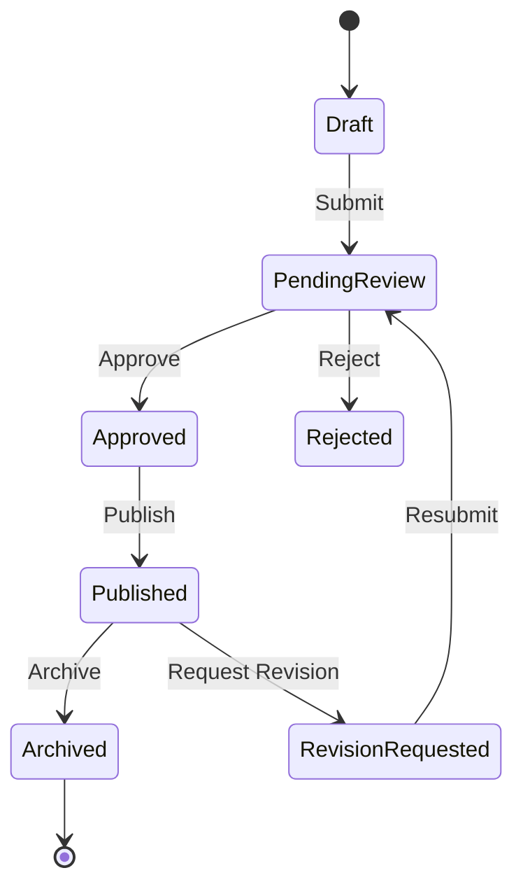

# 📚 RHS-005: Knowledge Hub & Resource Management

> **Requirement Hardening Specification**
>
> **Reference:** PRD §8.5 – Knowledge Hub
>
> **Status:** ✅ Approved
>
> **Priority:** 🟡 High (Core MVP)

---

# 📖 Overview

Dokumen ini mendefinisikan aturan implementasi untuk modul **Knowledge Hub** pada Platform Digital Informatika Angkatan 2025.

Knowledge Hub berfungsi sebagai repositori terpusat untuk materi pembelajaran, modul, catatan, referensi, serta resource akademik yang dapat digunakan oleh seluruh mahasiswa.

Seluruh resource harus melalui proses validasi dan approval sebelum dipublikasikan agar kualitas informasi tetap terjaga.

---

# 🎯 Objective

- Menyediakan repositori pembelajaran terpusat.
- Menjamin kualitas resource melalui approval workflow.
- Menjaga histori kontribusi mahasiswa.
- Mendukung publikasi resource secara aman.
- Memastikan seluruh perubahan dapat diaudit.

---

# 📌 Scope

Requirement ini mencakup:

- Resource Upload
- Resource Approval
- Resource Publication
- Resource Metadata
- External Resource
- File Resource
- Contributor Attribution

Requirement ini **tidak mencakup**:

- Video Hosting
- Recommendation System
- AI Search
- Resource Rating
- Resource Comment

Seluruh fitur tersebut berada di luar ruang lingkup MVP.

---

# 📋 Business Rules

| ID | Rule |
|----|------|
| KH-01 | Mahasiswa yang telah login dapat mengunggah resource. |
| KH-02 | Seluruh resource baru memiliki status **Pending Review**. |
| KH-03 | Resource tidak boleh dipublikasikan tanpa approval. |
| KH-04 | Resource dapat berupa file maupun tautan eksternal. |
| KH-05 | Resource wajib memiliki metadata minimum. |
| KH-06 | Resource yang ditolak wajib memiliki alasan penolakan. |
| KH-07 | Resource yang telah dipublikasikan tidak dapat diedit langsung oleh kontributor. |
| KH-08 | Kontributor dapat mengajukan permintaan revisi atau penghapusan. |
| KH-09 | Identitas kontributor diketahui sistem meskipun tidak selalu ditampilkan kepada pengguna lain. |
| KH-10 | Seluruh aktivitas resource wajib tercatat pada audit log. |

---

# ✅ Validation Rules

| ID | Rule |
|----|------|
| VAL-01 | Judul wajib diisi. |
| VAL-02 | Mata kuliah wajib dipilih. |
| VAL-03 | Kategori wajib valid. |
| VAL-04 | Deskripsi wajib diisi. |
| VAL-05 | Minimal satu file atau satu tautan harus tersedia. |
| VAL-06 | URL eksternal harus menggunakan format yang valid. |
| VAL-07 | Ukuran file tidak boleh melebihi batas sistem. |
| VAL-08 | Format file harus termasuk whitelist sistem. |

---

# 📄 Supported File Types

| Format | Status |
|---------|--------|
| PDF | ✅ Supported |
| DOCX | ✅ Supported |
| PPTX | ✅ Supported |
| XLSX | ✅ Supported |
| JPG / PNG | ✅ Supported |
| External URL | ✅ Supported |
| Video Upload | ❌ Out of Scope |

---

# 🔐 Permission Rules

| Role | Permission |
|------|------------|
| Guest | Melihat resource publik. |
| Student | Upload resource, melihat resource yang telah dipublikasikan. |
| Administrator | Review, approve, reject resource. |
| Superadmin | Kontrol penuh terhadap seluruh resource. |

---

# 🔄 Resource Lifecycle



---

# 🔄 Approval Workflow

```mermaid
flowchart LR

A[Student Upload]
--> B[Pending Review]

B -->|Approve| C[Published]

B -->|Reject| D[Rejected]

C --> E[Visible to Students]

E --> F[Public (Optional)]

D --> G[Revision]
```

---

# 📑 Metadata Requirements

Setiap resource minimal memiliki informasi berikut.

| Field | Required |
|--------|----------|
| Title | ✅ |
| Description | ✅ |
| Course | ✅ |
| Category | ✅ |
| Contributor | ✅ |
| Upload Date | ✅ |
| Attribution | ✅ |
| Tags | Optional |

---

# 🌍 Visibility Rules

| Visibility | Description |
|------------|-------------|
| Internal | Hanya mahasiswa yang login. |
| Public | Resource yang telah disetujui untuk landing page publik. |

---

# ⚠ Edge Cases & Error Handling

| Scenario | Expected Behavior |
|----------|-------------------|
| File rusak | Upload ditolak. |
| URL tidak valid | Resource tidak dapat disimpan. |
| Upload ganda | Sistem mencegah duplikasi jika memungkinkan. |
| Approval gagal | Status tetap Pending Review. |
| File dihapus dari storage | Resource diberi status unavailable dan dicatat pada audit log. |

---

# ✅ Acceptance Criteria

| ID | Given | When | Then |
|----|-------|------|------|
| AC-01 | Resource baru | Submit | Status menjadi Pending Review. |
| AC-02 | Resource di-approve | Publish | Resource dapat diakses mahasiswa. |
| AC-03 | Resource ditolak | Reviewer memberi alasan | Kontributor menerima alasan penolakan. |
| AC-04 | Resource dipublikasikan | Dashboard dimuat | Resource muncul pada daftar terbaru. |
| AC-05 | Resource diarsipkan | User membuka Knowledge Hub | Resource tidak muncul pada daftar aktif. |

---

# 🔒 Security Considerations

- File harus dipindai terhadap malware sebelum dipublikasikan (jika infrastruktur mendukung).
- File tidak boleh dapat diakses langsung tanpa kontrol akses.
- Nama file disimpan menggunakan identifier acak.
- Resource hanya dapat dimodifikasi oleh role yang berwenang.
- Semua endpoint upload harus menggunakan autentikasi.

---

# 📝 Audit Requirements

Sistem wajib mencatat aktivitas berikut.

| Event |
|-------|
| Resource Uploaded |
| Resource Updated |
| Resource Submitted |
| Resource Approved |
| Resource Rejected |
| Resource Published |
| Resource Archived |
| Resource Deleted |

---

# 📊 Data Model Reference

```typescript
interface Resource {
  id: string;
  title: string;
  description: string;
  course: string;
  category: string;
  contributor_id: string;
  visibility: "internal" | "public";
  status:
    | "draft"
    | "pending_review"
    | "approved"
    | "published"
    | "rejected"
    | "archived";
  file_url?: string;
  external_url?: string;
  attribution: string;
  uploaded_at: Date;
  updated_at: Date;
}
```

---

# 🌐 API Contract Reference

### Upload Resource

```http
POST /api/v1/resources
```

### Approve Resource

```http
PATCH /api/v1/resources/{id}/approve
```

### Reject Resource

```http
PATCH /api/v1/resources/{id}/reject
```

### Archive Resource

```http
PATCH /api/v1/resources/{id}/archive
```

---

# 📑 Requirement Traceability Matrix (RTM)

| PRD Reference | Requirement IDs |
|--------------|-----------------|
| PRD §8.5 – Knowledge Hub | KH-01 → KH-10 |
| PRD §10.1 – RBAC | Permission Rules |
| PRD §12.1 – Audit Log | Audit Requirements |
| PRD §13.3 – Object Storage | File Storage Rules |

---

# 🔗 Related Documents

- PRD §8.5 – Knowledge Hub
- RHS-008 – RBAC
- RHS-009 – Security
- RHS-010 – Privacy
- RHS-012 – Audit Log
- RHS-013 – Backup & Recovery

---

# 📝 Notes

Knowledge Hub merupakan salah satu fitur inti MVP dan berfungsi sebagai repositori pembelajaran terpusat. Seluruh implementasi harus mengikuti prinsip **Security by Default**, **Least Privilege**, **Auditability**, dan **Single Source of Truth** untuk memastikan resource yang dipublikasikan tetap terpercaya, mudah dikelola, dan dapat dipertanggungjawabkan.
