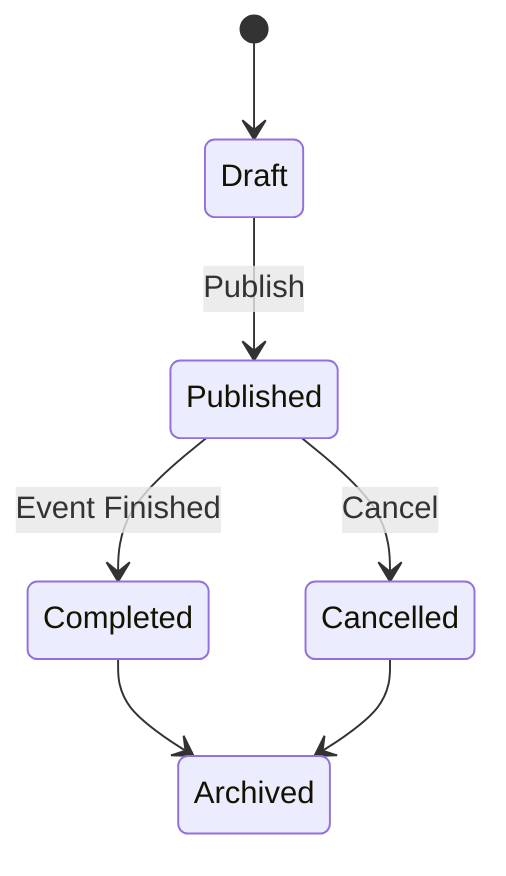
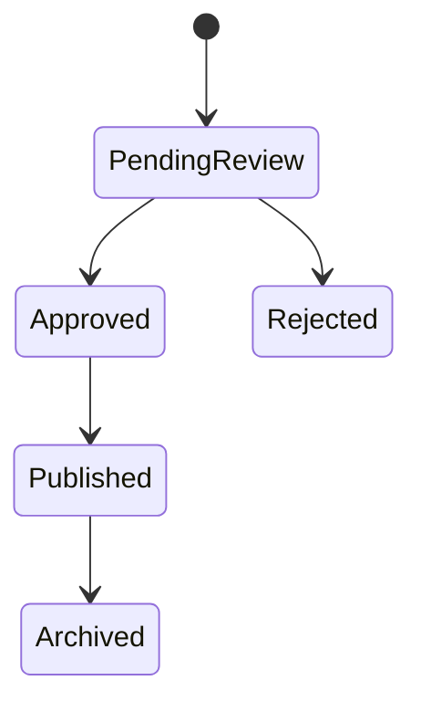

# 🎉 RHS-006: Event & Gallery

> **Requirement Hardening Specification**
>
> **Reference:** PRD §8.6 – Event & PRD §8.7 – Gallery
>
> **Status:** ✅ Approved
>
> **Priority:** 🟡 Medium (Non Launch Blocking)

---

## 📖 Overview

Requirement ini mendefinisikan aturan implementasi untuk modul **Event** dan **Gallery** pada Platform Informatika Angkatan 2025.

Modul Event digunakan untuk mempublikasikan informasi kegiatan angkatan, sedangkan Gallery berfungsi sebagai dokumentasi aktivitas yang telah melalui proses moderasi.

Walaupun kedua modul merupakan bagian dari produk, keduanya **bukan fitur Launch Blocking** dan dapat dirilis setelah Core MVP stabil.

---

# 🎯 Objectives

## Event

- Menyediakan informasi kegiatan yang jelas dan terstruktur.
- Menjadi sumber informasi resmi mengenai aktivitas angkatan.
- Memudahkan mahasiswa mengetahui kegiatan yang akan datang.

## Gallery

- Menjadi dokumentasi resmi aktivitas angkatan.
- Menjaga kualitas dokumentasi melalui proses approval.
- Memberikan ruang kontribusi dokumentasi dari mahasiswa.

---

# 📋 Business Rules

## Event

| ID | Rule |
|----|------|
| EVT-01 | Event hanya dapat dipublikasikan oleh role yang memiliki izin. |
| EVT-02 | Event wajib memiliki judul, deskripsi, waktu, dan lokasi. |
| EVT-03 | Event dapat memiliki poster atau gambar pendukung. |
| EVT-04 | Event dapat ditandai sebagai publik atau internal. |
| EVT-05 | Event yang telah selesai tetap dapat diakses sebagai arsip. |
| EVT-06 | Modul Event pada MVP hanya berfungsi sebagai media publikasi informasi kegiatan. |
| EVT-07 | Registrasi peserta, absensi, sertifikat, dan manajemen peserta berada di luar MVP. |

---

## Gallery

| ID | Rule |
|----|------|
| GAL-01 | Mahasiswa dapat mengunggah dokumentasi apabila modul tersedia. |
| GAL-02 | Seluruh unggahan masuk ke status **Pending Review**. |
| GAL-03 | Gallery hanya dipublikasikan setelah memperoleh approval Administrator atau Superadmin. |
| GAL-04 | Konten yang ditolak harus memiliki alasan penolakan. |
| GAL-05 | Konten yang telah dipublikasikan tidak dapat dihapus langsung oleh kontributor. |
| GAL-06 | Kontributor dapat mengajukan permintaan revisi atau penghapusan. |
| GAL-07 | Permintaan anonimisasi identitas harus diprioritaskan apabila memungkinkan. |

---

# ✅ Validation Rules

## Event

| ID | Rule |
|----|------|
| VAL-01 | Judul wajib diisi. |
| VAL-02 | Waktu mulai wajib tersedia. |
| VAL-03 | Lokasi wajib tersedia. |
| VAL-04 | Status event harus valid. |
| VAL-05 | Tanggal selesai tidak boleh lebih awal dari tanggal mulai. |

---

## Gallery

| ID | Rule |
|----|------|
| VAL-06 | Minimal terdapat satu file media. |
| VAL-07 | Format file mengikuti daftar format yang diizinkan sistem. |
| VAL-08 | Ukuran file mengikuti batas maksimum sistem. |
| VAL-09 | Metadata dasar harus tersedia. |
| VAL-10 | Konten wajib lolos proses approval sebelum tampil. |

---

# 🔐 Permission Rules

## Event

| Role | Permission |
|------|------------|
| Guest | Melihat event publik |
| Student | Melihat event internal |
| Administrator | Membuat, memperbarui, mengarsipkan event |
| Superadmin | Full Access |

---

## Gallery

| Role | Permission |
|------|------------|
| Guest | Melihat gallery publik |
| Student | Upload dokumentasi dan melihat gallery internal |
| Administrator | Approve / Reject Gallery |
| Superadmin | Full Access |

---

# 🔄 Event Lifecycle



---

## 📊 Event State Transition

| State | Allowed Transition |
|-------|--------------------|
| Draft | → Published |
| Published | → Completed, Cancelled |
| Completed | → Archived |
| Cancelled | → Archived |

---

# 🔄 Gallery Lifecycle



---

## 📊 Gallery State Transition

| State | Allowed Transition |
|-------|--------------------|
| Pending Review | → Approved, Rejected |
| Approved | → Published |
| Published | → Archived |

---

# ⚠️ Edge Cases

| Scenario | Expected Behavior |
|----------|-------------------|
| Event dibatalkan | Status menjadi Cancelled dan tidak lagi muncul sebagai event aktif |
| Event selesai | Berpindah menjadi Completed lalu Archived |
| Gallery mengandung konten sensitif | Ditolak dan dicatat alasannya |
| File upload gagal | Tidak membuat data parsial |
| Upload duplikat | Sistem melakukan validasi sesuai kebijakan |
| Permintaan anonimisasi | Diproses sesuai kebijakan privasi |

---

# ✅ Acceptance Criteria

| ID | Given | When | Then |
|----|-------|------|------|
| AC-01 | Event baru dibuat | Dipublikasikan | Event muncul pada daftar event |
| AC-02 | Event selesai | Tanggal berakhir terlewati | Event menjadi arsip |
| AC-03 | Gallery diunggah | Belum direview | Status Pending Review |
| AC-04 | Gallery disetujui | Dipublikasikan | Gallery tampil kepada pengguna |
| AC-05 | Gallery ditolak | Review selesai | Alasan penolakan tersimpan |

---

# 🔒 Security & Audit

## Security Requirements

- Hanya role berwenang yang dapat mempublikasikan Event.
- Seluruh upload file harus melalui validasi tipe file.
- Metadata file harus disanitasi.
- File executable tidak boleh diterima.
- Validasi MIME Type dilakukan di backend.
- File disimpan pada Object Storage.
- URL file tidak boleh mengekspos struktur penyimpanan internal.

---

## Audit Events

Sistem wajib mencatat aktivitas berikut:

### Event

- Event Created
- Event Updated
- Event Published
- Event Cancelled
- Event Archived

### Gallery

- Gallery Uploaded
- Gallery Approved
- Gallery Rejected
- Gallery Published
- Gallery Archived

---

# 📊 Data Model Reference

## Event

```typescript
interface Event {
  id: string;
  title: string;
  description: string;
  location: string;
  startDate: Date;
  endDate: Date;
  visibility: "public" | "internal";
  status: "draft" | "published" | "completed" | "cancelled" | "archived";
  posterUrl?: string;
}
```

---

## Gallery

```typescript
interface GalleryItem {
  id: string;
  title: string;
  description: string;
  mediaUrl: string;
  uploaderId: string;
  status: "pending" | "approved" | "rejected" | "published" | "archived";
  uploadedAt: Date;
}
```

---

# 🔗 Requirement Traceability Matrix (RTM)

| RHS ID | PRD Reference | Requirement |
|---------|---------------|-------------|
| RHS-006 | §5.2 | Event merupakan Non Launch Blocking Feature |
| RHS-006 | §8.6 | Event |
| RHS-006 | §8.7 | Gallery |
| RHS-006 | §10.3 | Privacy |
| RHS-006 | §12.1 | Audit Log |
| RHS-006 | §13.3 | Object Storage |
| RHS-006 | §17.5 | Acceptance Criteria |

---

# 🔗 Related Documents

- PRD §8.6 – Event
- PRD §8.7 – Gallery
- RHS-008 – Role-Based Access Control (RBAC)
- RHS-009 – Security
- RHS-010 – Privacy
- RHS-012 – Audit Log
- RHS-013 – Backup & Recovery

---

# 📝 Notes

- Modul **Event** berfungsi sebagai media publikasi kegiatan pada MVP.
- Registrasi peserta, absensi, sertifikat, dan manajemen peserta akan dipertimbangkan pada fase berikutnya.
- Modul **Gallery** menggunakan workflow approval untuk menjaga kualitas dokumentasi.
- Seluruh file media direkomendasikan disimpan pada **Object Storage** agar penyimpanan terpisah dari database.
- Implementasi harus mengikuti prinsip **Security by Default**, **Least Privilege**, **Auditability**, dan **Privacy by Design**.
