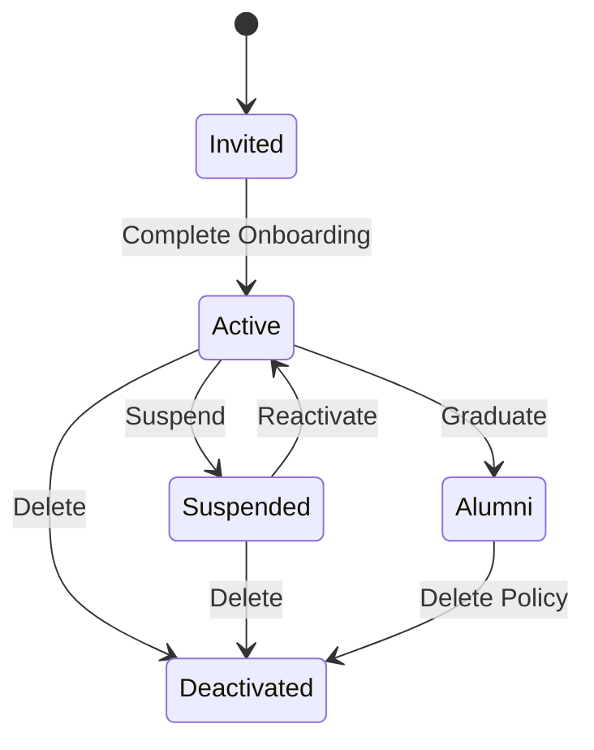

# ♻️ RHS-007: Account Lifecycle Management

> **Requirement Hardening Specification**
>
> **Reference:** PRD §10.4 – Data Retention & Deletion
>
> **Status:** ✅ Approved
>
> **Priority:** 🟡 High

---

# 📖 Overview

Dokumen ini mendefinisikan lifecycle akun mahasiswa mulai dari akun dibuat hingga menjadi alumni atau dinonaktifkan. Requirement ini memastikan perubahan status akun dilakukan secara konsisten, aman, terdokumentasi, dan dapat diaudit.

Seluruh perubahan status akun harus mengikuti prinsip **Auditability**, **Least Privilege**, **Data Integrity**, dan **Operational Continuity**.

---

# 🎯 Objective

- Mendefinisikan lifecycle akun secara eksplisit.
- Menjamin perubahan status akun dapat diaudit.
- Menentukan hak akses berdasarkan status akun.
- Menjamin data historis tetap terjaga.
- Mendukung proses transisi mahasiswa menjadi alumni.

---

# 📋 Business Rules

| ID | Rule |
|----|------|
| ACL-01 | Setiap akun memiliki tepat satu status aktif pada satu waktu. |
| ACL-02 | Status akun hanya dapat berubah melalui proses yang telah ditentukan sistem. |
| ACL-03 | Perubahan status akun harus tercatat pada Audit Log. |
| ACL-04 | Mahasiswa yang telah lulus berubah menjadi Alumni tanpa menghapus histori kontribusinya. |
| ACL-05 | Akun yang dinonaktifkan tidak dapat digunakan untuk login. |
| ACL-06 | Suspend tidak menghapus data pengguna. |
| ACL-07 | Penghapusan akun harus mengikuti kebijakan retensi data. |
| ACL-08 | Penghapusan akun tidak otomatis menghapus audit log. |
| ACL-09 | Riwayat kontribusi tetap dipertahankan kecuali diwajibkan oleh hukum atau permintaan khusus yang disetujui. |

---

# ✅ Validation Rules

| ID | Rule |
|----|------|
| VAL-01 | Status akun hanya boleh menggunakan nilai yang ditentukan sistem. |
| VAL-02 | Tidak boleh terdapat dua status aktif secara bersamaan. |
| VAL-03 | Akun Deactivated tidak boleh melakukan autentikasi. |
| VAL-04 | Alumni tetap dapat login apabila kebijakan platform mengizinkan. |
| VAL-05 | Suspend harus memiliki alasan suspend yang terdokumentasi. |

---

# 🔐 Permission Rules

| Role | Permission |
|------|------------|
| Student | Melihat status akun sendiri. |
| Alumni | Mengakses fitur yang masih diizinkan. |
| Administrator | Suspend dan mengaktifkan kembali akun sesuai kewenangan. |
| Superadmin | Mengubah seluruh status akun dan melakukan penghapusan sesuai kebijakan. |

---

# 🔄 Lifecycle State



---

# 📊 Lifecycle Summary

| Status | Description |
|---------|-------------|
| Invited | Akun telah dibuat namun onboarding belum selesai. |
| Active | Mahasiswa aktif menggunakan platform. |
| Suspended | Akses sementara dicabut tanpa menghapus data. |
| Alumni | Mahasiswa telah lulus dan mengikuti kebijakan alumni. |
| Deactivated | Akun dinonaktifkan permanen. |

---

# ⚠️ Edge Cases

| Scenario | Expected Behaviour |
|----------|--------------------|
| Mahasiswa lulus saat akun sedang Suspend | Status berubah menjadi Alumni sesuai kebijakan institusi. |
| Suspend dicabut | Akun kembali Active tanpa kehilangan data. |
| Akun Deactivated mencoba login | Login ditolak. |
| Permintaan penghapusan data pribadi | Diproses sesuai kebijakan Privacy dan Data Retention. |
| Restore backup | Status akun harus tetap konsisten dengan audit log. |

---

# ✅ Acceptance Criteria

| ID | Given | When | Then |
|----|-------|------|------|
| AC-01 | Akun Active | Admin melakukan suspend | Status berubah menjadi Suspended. |
| AC-02 | Akun Suspended | Admin melakukan reactivation | Status kembali Active. |
| AC-03 | Mahasiswa lulus | Sistem menjalankan proses kelulusan | Status berubah menjadi Alumni. |
| AC-04 | Akun Deactivated | Pengguna mencoba login | Login ditolak. |
| AC-05 | Status akun berubah | Audit diperiksa | Seluruh perubahan status tercatat. |

---

# 🔒 Security Requirements

- Status akun hanya boleh diubah oleh role yang memiliki permission.
- Perubahan status wajib menggunakan endpoint yang tervalidasi.
- Seluruh perubahan status harus tercatat pada Audit Log.
- Soft Delete lebih diprioritaskan dibanding Hard Delete selama masih memungkinkan.
- Penghapusan permanen harus mengikuti kebijakan Data Retention.

---

# 📑 Audit Events

Sistem wajib mencatat aktivitas berikut.

| Event |
|--------|
| Account Activated |
| Account Suspended |
| Account Reactivated |
| Account Graduated |
| Account Deactivated |
| Account Restored |

---

# 📊 Data Model Reference

```typescript
type AccountStatus =
  | "invited"
  | "active"
  | "suspended"
  | "alumni"
  | "deactivated";

interface AccountLifecycle {
  id: string;
  status: AccountStatus;
  changedBy: string;
  changedAt: Date;
  reason?: string;
}
```

---

# 🌐 API Contract Reference

## Update Account Status

```http
PATCH /api/v1/accounts/{id}/status
```

```json
{
  "status": "suspended",
  "reason": "Academic misconduct investigation"
}
```

---

## Reactivate Account

```http
POST /api/v1/accounts/{id}/reactivate
```

---

## Graduate Student

```http
POST /api/v1/accounts/{id}/graduate
```

---

## Deactivate Account

```http
DELETE /api/v1/accounts/{id}
```

---

# 📌 Requirement Traceability Matrix (RTM)

| RHS ID | PRD Reference |
|---------|---------------|
| ACL-01 – ACL-09 | §10.4 Data Retention & Deletion |
| VAL-01 – VAL-05 | §10.4 |
| Permission Rules | §6 User Roles |
| Lifecycle | §7.3 Onboarding |
| Acceptance Criteria | §17 Operational Readiness |

---

# 🔗 Related Documents

- PRD §7.3 – Onboarding
- PRD §10.4 – Data Retention & Deletion
- RHS-001 – Authentication & Onboarding
- RHS-008 – RBAC & Least Privilege
- RHS-009 – Security & 2FA
- RHS-010 – Privacy & Data Visibility
- RHS-012 – Audit Log

---

# 📝 Notes

- Account Lifecycle harus bersifat deterministic.
- Perubahan status akun tidak boleh menyebabkan kehilangan data historis.
- Penghapusan akun harus mengikuti kebijakan Data Retention yang berlaku.
- Seluruh perubahan status wajib dapat ditelusuri melalui Audit Log.
