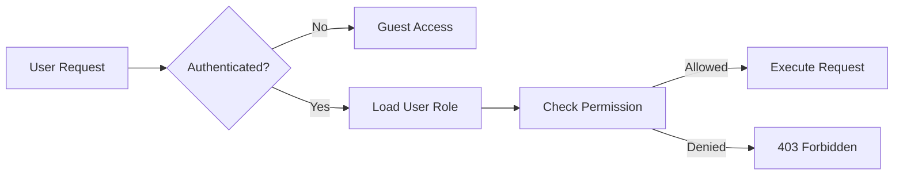

# 🔐 RHS-008: Role-Based Access Control (RBAC) & Least Privilege

> **Requirement Hardening Specification**
>
> **Reference:** PRD §6 – Users, Stakeholders & Roles  
> **Reference:** PRD §10.1 – RBAC
>
> **Status:** ✅ Approved
>
> **Priority:** 🔴 Critical (Launch Blocking)

---

# 📖 Overview

Dokumen ini mendefinisikan implementasi **Role-Based Access Control (RBAC)** pada Platform Informatika Angkatan 2025.

Seluruh hak akses harus ditentukan berdasarkan **role**, bukan berdasarkan pengguna secara langsung. Backend merupakan sumber otoritatif (source of truth) dalam proses authorization, sedangkan frontend hanya bertugas menyembunyikan atau menampilkan antarmuka sesuai permission yang diterima.

Implementasi RBAC wajib mengikuti prinsip:

- Least Privilege
- Need to Know
- Separation of Duties
- Default Deny

---

# 🎯 Objective

- Menentukan hak akses setiap role.
- Mencegah akses yang tidak berwenang.
- Menjadi baseline implementasi authorization.
- Menjamin keamanan operasi administratif.
- Mempermudah audit hak akses.

---

# 📋 Business Rules

| ID | Rule |
|----|------|
| RBAC-01 | Setiap akun wajib memiliki tepat satu role aktif. |
| RBAC-02 | Permission diberikan berdasarkan role, bukan berdasarkan user individual. |
| RBAC-03 | Backend menjadi sumber utama authorization. |
| RBAC-04 | Frontend tidak boleh dijadikan mekanisme keamanan utama. |
| RBAC-05 | Permission harus mengikuti prinsip Least Privilege. |
| RBAC-06 | Role Administrator tidak boleh memiliki hak yang setara dengan Superadmin. |
| RBAC-07 | Guest hanya dapat mengakses informasi publik. |
| RBAC-08 | Mahasiswa hanya dapat mengelola data miliknya sendiri kecuali dinyatakan lain. |
| RBAC-09 | Seluruh perubahan role wajib dicatat pada Audit Log. |
| RBAC-10 | Perubahan permission hanya dapat dilakukan melalui konfigurasi resmi sistem. |

---

# 👥 Role Definition

| Role | Description |
|------|-------------|
| Guest | Pengunjung tanpa autentikasi. |
| Student | Mahasiswa Informatika Angkatan 2025 yang telah login. |
| Administrator | Pengelola operasional harian platform. |
| Superadmin | Pengelola utama dengan kontrol penuh terhadap sistem. |

---

# 🔐 Permission Matrix

| Feature | Guest | Student | Administrator | Superadmin |
|---------|:----:|:-------:|:-------------:|:----------:|
| Login | ❌ | ✅ | ✅ | ✅ |
| Dashboard | ❌ | ✅ | ✅ | ✅ |
| Official Information (Read) | Public Only | ✅ | ✅ | ✅ |
| Create Official Information | ❌ | ❌ | ✅ | ✅ |
| Publish Official Information | ❌ | ❌ | ✅* | ✅ |
| Manage Schedule | ❌ | ❌ | ✅ | ✅ |
| Manage Exception Schedule | ❌ | ❌ | ✅ | ✅ |
| Upload Resource | ❌ | ✅ | ✅ | ✅ |
| Approve Resource | ❌ | ❌ | ✅ | ✅ |
| Manage Event | ❌ | ❌ | ✅ | ✅ |
| Manage Gallery | ❌ | ❌ | ✅ | ✅ |
| Manage Student Account | ❌ | ❌ | Limited | ✅ |
| Reset Password | ❌ | ❌ | ❌ | ✅ |
| Assign Role | ❌ | ❌ | ❌ | ✅ |
| View Audit Log | ❌ | ❌ | Limited | ✅ |
| System Configuration | ❌ | ❌ | ❌ | ✅ |

> **Catatan:** Hak publish Administrator mengikuti kebijakan operasional yang ditetapkan oleh Superadmin.

---

# ✅ Validation Rules

| ID | Rule |
|----|------|
| VAL-01 | Role harus valid sesuai daftar role sistem. |
| VAL-02 | Permission harus berasal dari role aktif. |
| VAL-03 | User tanpa role dianggap tidak memiliki akses. |
| VAL-04 | Endpoint administratif wajib memverifikasi role. |
| VAL-05 | Permission tidak boleh ditentukan hanya oleh frontend. |

---

# 🔄 Authorization Flow



---

# 🔒 Least Privilege Rules

- Guest hanya dapat mengakses konten publik.
- Student tidak dapat mengakses fungsi administrasi.
- Administrator hanya memiliki hak operasional.
- Superadmin memiliki hak penuh terhadap sistem.
- Permission diberikan seminimal mungkin sesuai kebutuhan.

---

# ⚠️ Edge Cases

| Scenario | Expected Behaviour |
|----------|--------------------|
| User tanpa role | Akses ditolak. |
| Permission berubah saat sesi aktif | Sistem menggunakan permission terbaru pada request berikutnya. |
| Endpoint dipanggil langsung | Backend tetap memvalidasi permission. |
| Frontend menampilkan menu yang tidak sesuai | Backend tetap menolak request tanpa permission. |
| Administrator mencoba mengubah role Superadmin | Ditolak. |

---

# ✅ Acceptance Criteria

| ID | Given | When | Then |
|----|-------|------|------|
| AC-01 | Student | Membuka endpoint admin | Response 403 Forbidden. |
| AC-02 | Administrator | Mengelola jadwal | Berhasil jika memiliki permission. |
| AC-03 | Superadmin | Mengubah role user | Berhasil. |
| AC-04 | Guest | Membuka dashboard internal | Redirect ke login. |
| AC-05 | Permission dicabut | User melakukan request | Request ditolak. |

---

# 🛡️ Security Requirements

- Authorization dilakukan pada setiap request.
- Permission tidak boleh disimpan hanya di frontend.
- Token autentikasi harus divalidasi sebelum pengecekan role.
- Role tidak boleh dimodifikasi melalui client.
- Perubahan role wajib menghasilkan Audit Log.

---

# 📑 Audit Events

Sistem wajib mencatat aktivitas berikut.

| Event |
|--------|
| Role Assigned |
| Role Changed |
| Permission Updated |
| Unauthorized Access Attempt |
| Privileged Operation |

---

# 📊 Data Model Reference

```typescript
type Role =
  | "guest"
  | "student"
  | "administrator"
  | "superadmin";

interface UserRole {
  userId: string;
  role: Role;
  assignedBy: string;
  assignedAt: Date;
}
```

---

# 🌐 API Contract Reference

## Get Current User

```http
GET /api/v1/me
```

---

## Update User Role

```http
PATCH /api/v1/users/{id}/role
```

```json
{
  "role": "administrator"
}
```

---

## Get Permissions

```http
GET /api/v1/me/permissions
```

---

# 📌 Requirement Traceability Matrix (RTM)

| RHS ID | PRD Reference |
|---------|---------------|
| RBAC-01 – RBAC-10 | §10.1 RBAC |
| Validation Rules | §10.1 |
| Permission Matrix | §6 User Roles |
| Authorization Flow | §10 Security |
| Acceptance Criteria | §17 MVP Readiness |

---

# 🔗 Related Documents

- PRD §6 – Users, Stakeholders & Roles
- PRD §10.1 – RBAC
- RHS-001 – Authentication & Onboarding
- RHS-002 – Official Information
- RHS-007 – Account Lifecycle
- RHS-009 – Security, 2FA & Password Reset
- RHS-012 – Audit Log

---

# 📝 Notes

- Backend merupakan sumber otoritatif untuk seluruh proses authorization.
- Seluruh endpoint administratif wajib melakukan validasi permission.
- Least Privilege menjadi prinsip utama dalam pemberian hak akses.
- Setiap perubahan role dan permission harus dapat ditelusuri melalui Audit Log.
- RBAC merupakan **Launch Blocking Requirement** dan wajib selesai sebelum MVP dirilis.
