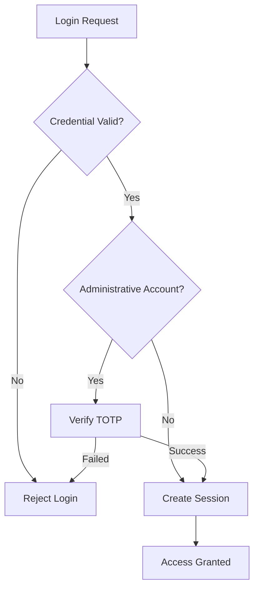
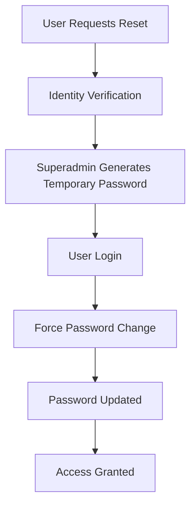

# 🛡️ RHS-009: Security, Multi-Factor Authentication (2FA) & Password Reset

> **Requirement Hardening Specification**
>
> **Reference:** PRD §10.2 – Administrative Security  
> **Reference:** PRD §10 – Authentication, Authorization, Privacy & Security
>
> **Status:** ✅ Approved
>
> **Priority:** 🔴 Critical (Launch Blocking)

---

# 📖 Overview

Dokumen ini mendefinisikan requirement implementasi keamanan (Security Baseline) pada Platform Informatika Angkatan 2025.

Fokus utama dokumen ini meliputi:

- Password Security
- Administrative Authentication
- Two-Factor Authentication (TOTP)
- Password Reset
- Session Security
- Credential Protection
- Recovery Procedure

Seluruh implementasi wajib mengikuti prinsip:

- Security by Default
- Least Privilege
- Defense in Depth
- Zero Trust
- Auditability

---

# 🎯 Objective

- Melindungi akun dari akses tidak sah.
- Menjamin keamanan kredensial pengguna.
- Mengurangi risiko account takeover.
- Menjamin proses recovery akun tetap aman.
- Menjadi baseline implementasi keamanan MVP.

---

# 📋 Business Rules

| ID | Rule |
|----|------|
| SEC-01 | Password tidak boleh disimpan dalam bentuk plaintext. |
| SEC-02 | Password wajib menggunakan algoritma hashing yang aman (Argon2id atau BCrypt). |
| SEC-03 | TOTP 2FA wajib diaktifkan untuk seluruh akun administratif. |
| SEC-04 | Backup Codes diberikan saat aktivasi 2FA. |
| SEC-05 | Backup Codes hanya ditampilkan satu kali saat dibuat. |
| SEC-06 | Password Reset pada MVP hanya dilakukan oleh Superadmin. |
| SEC-07 | Temporary Password wajib diganti saat login berikutnya. |
| SEC-08 | Password lama tidak boleh digunakan kembali pada proses reset langsung. |
| SEC-09 | Seluruh aktivitas keamanan wajib dicatat dalam Audit Log. |
| SEC-10 | Session harus dihentikan setelah logout atau token kedaluwarsa. |

---

# ✅ Validation Rules

| ID | Rule |
|----|------|
| VAL-01 | Password minimal 12 karakter. |
| VAL-02 | Password harus memenuhi kompleksitas minimum sesuai kebijakan sistem. |
| VAL-03 | Password tidak boleh mengandung NIM, nama, atau tanggal lahir. |
| VAL-04 | TOTP harus menggunakan standar RFC 6238. |
| VAL-05 | Backup Code hanya dapat digunakan satu kali. |
| VAL-06 | Temporary Password memiliki masa berlaku sesuai kebijakan keamanan. |

---

# 🔐 Permission Rules

| Role | Permission |
|------|------------|
| Guest | Tidak memiliki akses ke fitur keamanan. |
| Student | Mengubah password sendiri. |
| Administrator | Wajib menggunakan TOTP 2FA. |
| Superadmin | Mengelola proses reset password dan recovery akun administratif. |

---

# 🔄 Authentication Flow



---

# 🔄 Password Reset Flow



---

# ⚠️ Edge Cases

| Scenario | Expected Behaviour |
|----------|--------------------|
| Password salah berulang | Login ditolak dan dicatat pada Audit Log. |
| TOTP salah | Login ditolak tanpa membuka sesi. |
| Backup Code digunakan dua kali | Ditolak. |
| Password Reset tanpa verifikasi | Ditolak. |
| Token kedaluwarsa | User harus login kembali. |
| Session dicuri | Token menjadi tidak valid setelah logout atau expiry. |

---

# ✅ Acceptance Criteria

| ID | Given | When | Then |
|----|-------|------|------|
| AC-01 | Password benar | Login | Sistem membuat sesi baru. |
| AC-02 | Admin login | TOTP valid | Login berhasil. |
| AC-03 | Admin login | TOTP tidak valid | Login ditolak. |
| AC-04 | Password direset | User login | Sistem memaksa perubahan password. |
| AC-05 | Logout | Request berikutnya | Session tidak lagi valid. |

---

# 🛡️ Security Requirements

## Password Security

- Password disimpan menggunakan Argon2id atau BCrypt.
- Password Hash tidak pernah dikirim ke client.
- Password tidak boleh dicatat pada log.
- Password tidak boleh dikembalikan melalui API.

---

## Two-Factor Authentication

- Menggunakan TOTP (RFC 6238).
- Secret Key harus dienkripsi saat disimpan.
- Backup Code harus dihasilkan secara acak.
- Backup Code hanya dapat digunakan satu kali.
- Backup Code tidak boleh dapat dipulihkan setelah dibuat.

---

## Session Security

- Session menggunakan Secure Cookie atau JWT sesuai arsitektur.
- Token memiliki waktu kedaluwarsa.
- Logout mengakhiri sesi aktif.
- Session ID harus diacak secara kriptografis.

---

## Credential Protection

- HTTPS wajib digunakan.
- Rate Limiting wajib diterapkan pada endpoint login.
- Credential tidak boleh muncul pada URL.
- Credential tidak boleh disimpan pada Local Storage jika menggunakan Cookie Authentication.

---

# 📑 Audit Events

Sistem wajib mencatat aktivitas berikut.

| Event |
|--------|
| Login Success |
| Login Failed |
| Logout |
| Password Changed |
| Password Reset |
| 2FA Enabled |
| 2FA Disabled |
| Backup Code Used |
| Recovery Procedure |
| Suspicious Login Attempt |

---

# 📊 Data Model Reference

```typescript
interface SecurityEvent {
  id: string;
  userId: string;
  event:
    | "login_success"
    | "login_failed"
    | "password_changed"
    | "password_reset"
    | "2fa_enabled"
    | "2fa_disabled";
  timestamp: Date;
  ipAddress: string;
}
```

---

# 🌐 API Contract Reference

## Login

```http
POST /api/v1/auth/login
```

---

## Verify TOTP

```http
POST /api/v1/auth/2fa/verify
```

```json
{
  "code": "123456"
}
```

---

## Enable 2FA

```http
POST /api/v1/auth/2fa/enable
```

---

## Reset Password

```http
POST /api/v1/auth/reset-password
```

```json
{
  "userId": "uuid",
  "reason": "User requested password reset"
}
```

---

# 📌 Requirement Traceability Matrix (RTM)

| RHS ID | PRD Reference |
|---------|---------------|
| SEC-01 – SEC-10 | PRD §10.2 Administrative Security |
| Validation Rules | PRD §10 |
| Password Security | PRD §10 |
| Session Security | PRD §10 |
| Acceptance Criteria | PRD §17 |

---

# 🔗 Related Documents

- PRD §8.1 – Authentication & Account
- PRD §10 – Authentication, Authorization, Privacy & Security
- RHS-001 – Authentication & Onboarding
- RHS-007 – Account Lifecycle
- RHS-008 – RBAC & Least Privilege
- RHS-010 – Privacy & Data Visibility
- RHS-012 – Audit Log

---

# 📝 Notes

- Two-Factor Authentication (TOTP) **wajib** untuk seluruh akun administratif pada MVP.
- Password Reset Self-Service **bukan bagian dari MVP** dan hanya dapat dilakukan oleh Superadmin setelah proses verifikasi identitas.
- Seluruh endpoint autentikasi harus menerapkan **HTTPS**, **Rate Limiting**, dan **Audit Logging**.
- Implementasi keamanan wajib mengikuti prinsip **Security by Default**, **Least Privilege**, **Defense in Depth**, dan **Zero Trust**.
- Dokumen ini merupakan **Launch Blocking Requirement** dan harus dipenuhi sebelum sistem dinyatakan siap produksi.
