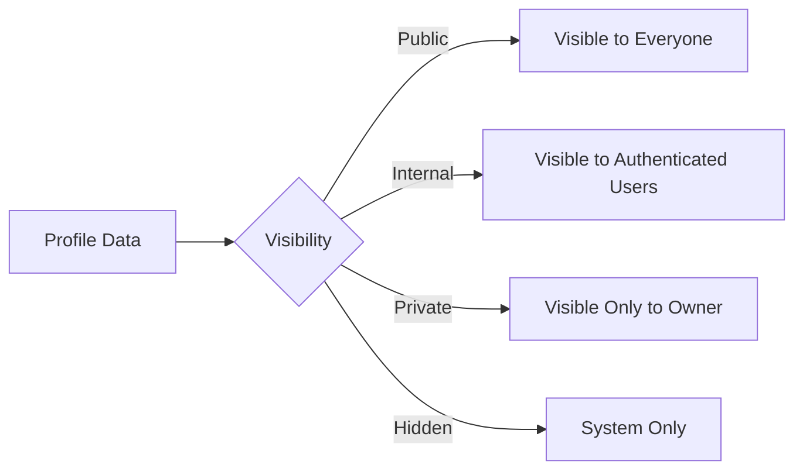

# 🔒 RHS-010: Privacy & Data Visibility

> **Requirement Hardening Specification**
>
> **Reference:** PRD §10.3 – Privacy
>
> **Status:** ✅ Approved
>
> **Priority:** 🟡 High

---

# 📖 Overview

Dokumen ini mendefinisikan aturan implementasi terkait privasi data pengguna, visibilitas informasi profil, serta pengelolaan data pribadi pada Platform Informatika Angkatan 2025.

Seluruh implementasi harus mengikuti prinsip:

- Privacy by Default
- Data Minimization
- Need to Know
- Least Privilege
- Transparency
- Accountability

---

# 🎯 Objective

- Melindungi data pribadi pengguna.
- Mengontrol visibilitas informasi profil.
- Menentukan hak akses terhadap data pribadi.
- Memenuhi prinsip privasi sejak tahap desain sistem.
- Menjadi baseline implementasi fitur privasi pada MVP.

---

# 📋 Business Rules

| ID | Rule |
|----|------|
| PRI-01 | Seluruh akun memiliki data profil dasar yang dikelola sistem. |
| PRI-02 | Informasi profil opsional bersifat **Private** secara default. |
| PRI-03 | Mahasiswa dapat memilih informasi profil yang ingin ditampilkan kepada pengguna lain. |
| PRI-04 | Password, password hash, session, token autentikasi, TOTP Secret, dan Backup Code tidak boleh ditampilkan kepada siapa pun selain sistem. |
| PRI-05 | Administrator hanya boleh mengakses data pribadi yang diperlukan untuk menjalankan tugas operasional. |
| PRI-06 | Superadmin memiliki akses administratif sesuai kebutuhan pengelolaan sistem. |
| PRI-07 | Pengguna dapat meminta penghapusan data pribadi sesuai kebijakan platform. |
| PRI-08 | Penghapusan data pribadi tidak menghapus audit log maupun histori kontribusi kecuali diwajibkan oleh kebijakan atau hukum. |
| PRI-09 | Kebijakan Privasi harus tersedia dan dapat diakses seluruh pengguna sejak MVP. |

---

# 👤 Data Classification

| Data | Visibility Default |
|------|--------------------|
| Nama | Internal |
| NIM | Internal |
| Angkatan | Internal |
| Asal Daerah | Internal |
| Foto Profil | Private |
| Instagram | Private |
| LinkedIn | Private |
| Hobi | Private |
| Cita-cita | Private |
| Bio | Private |
| Password | Hidden |
| Password Hash | Hidden |
| TOTP Secret | Hidden |
| Backup Code | Hidden |
| Login History | Hidden |

---

# ✅ Validation Rules

| ID | Rule |
|----|------|
| VAL-01 | Data wajib tidak boleh kosong. |
| VAL-02 | Data opsional dapat dikosongkan oleh pengguna. |
| VAL-03 | Password tidak boleh ditampilkan dalam bentuk apa pun. |
| VAL-04 | Password Hash tidak boleh dikirim melalui API. |
| VAL-05 | Informasi yang diset Private tidak boleh dapat diakses oleh pengguna lain. |
| VAL-06 | Perubahan pengaturan privasi harus langsung diterapkan. |

---

# 🔐 Permission Rules

| Role | Permission |
|------|------------|
| Guest | Tidak dapat melihat data internal mahasiswa. |
| Student | Mengelola pengaturan privasi akun sendiri. |
| Administrator | Mengakses data yang diperlukan untuk operasional sesuai kewenangan. |
| Superadmin | Mengakses data administratif sesuai kebutuhan pengelolaan sistem. |

---

# 🔄 Data Visibility Flow



---

# ⚠️ Edge Cases

| Scenario | Expected Behaviour |
|----------|--------------------|
| Mahasiswa menyembunyikan Instagram | Tidak muncul pada profil publik maupun internal. |
| Administrator membuka profil mahasiswa | Hanya data yang diperlukan yang ditampilkan. |
| API diminta mengembalikan Password Hash | Request ditolak. |
| Pengguna meminta penghapusan data pribadi | Diproses sesuai kebijakan Data Retention. |
| Profil belum lengkap | Sistem hanya meminta data wajib. |

---

# ✅ Acceptance Criteria

| ID | Given | When | Then |
|----|-------|------|------|
| AC-01 | Profil bersifat Private | Pengguna lain membuka profil | Data tidak ditampilkan. |
| AC-02 | Pengguna mengubah visibilitas profil | Perubahan disimpan | Visibilitas langsung diperbarui. |
| AC-03 | Guest membuka profil internal | Sistem memproses request | Akses ditolak. |
| AC-04 | Administrator melihat profil | Sistem memproses request | Hanya data yang diperlukan ditampilkan. |
| AC-05 | Password diminta melalui API | Response dikirim | Password tidak pernah dikembalikan. |

---

# 🛡️ Privacy Requirements

## Privacy by Default

- Seluruh informasi opsional bersifat **Private** secara default.
- Pengguna secara eksplisit menentukan informasi yang akan dipublikasikan.

---

## Data Minimization

Sistem hanya mengumpulkan data yang benar-benar diperlukan untuk operasional platform.

Data wajib:

- Nama
- NIM
- Angkatan
- Asal Daerah

Selain itu bersifat opsional.

---

## Sensitive Information

Data berikut tidak boleh pernah ditampilkan kepada pengguna lain maupun API publik:

- Password
- Password Hash
- Session Token
- Refresh Token
- TOTP Secret
- Backup Code
- Authentication Secret

---

## Personal Information

Pengguna dapat memilih menampilkan:

- Foto Profil
- Instagram
- LinkedIn
- Hobi
- Cita-cita
- Bio

---

# 📑 Audit Events

Sistem wajib mencatat aktivitas berikut.

| Event |
|--------|
| Profile Updated |
| Privacy Setting Changed |
| Personal Data Requested |
| Personal Data Deleted |
| Unauthorized Data Access Attempt |

---

# 📊 Data Model Reference

```typescript
type Visibility =
  | "public"
  | "internal"
  | "private"
  | "hidden";

interface ProfilePrivacy {
  profilePhoto: Visibility;
  instagram: Visibility;
  linkedin: Visibility;
  hobbies: Visibility;
  aspirations: Visibility;
  biography: Visibility;
}
```

---

# 🌐 API Contract Reference

## Get Profile

```http
GET /api/v1/profile/me
```

---

## Update Privacy Settings

```http
PATCH /api/v1/profile/privacy
```

```json
{
  "instagram": "private",
  "linkedin": "public",
  "profilePhoto": "internal"
}
```

---

## Delete Personal Data

```http
DELETE /api/v1/profile/personal-data
```

---

# 📌 Requirement Traceability Matrix (RTM)

| RHS ID | PRD Reference |
|---------|---------------|
| PRI-01 – PRI-09 | PRD §10.3 Privacy |
| Validation Rules | PRD §10.3 |
| Data Classification | PRD §10.3 |
| Permission Rules | PRD §6 User Roles |
| Acceptance Criteria | PRD §17 MVP Readiness |

---

# 🔗 Related Documents

- PRD §10.3 – Privacy
- PRD §10.4 – Data Retention & Deletion
- RHS-001 – Authentication & Onboarding
- RHS-007 – Account Lifecycle
- RHS-008 – RBAC & Least Privilege
- RHS-009 – Security, 2FA & Password Reset
- RHS-012 – Audit Log

---

# 📝 Notes

- Seluruh implementasi harus menerapkan prinsip **Privacy by Default** dan **Data Minimization**.
- Informasi sensitif tidak boleh pernah diekspos melalui UI maupun API.
- Pengguna memiliki kendali terhadap visibilitas informasi profil opsional.
- Penghapusan data pribadi harus mengikuti kebijakan Data Retention tanpa menghilangkan Audit Log yang diwajibkan.
- Dokumen ini menjadi acuan implementasi seluruh fitur privasi pada Platform Informatika Angkatan 2025.
